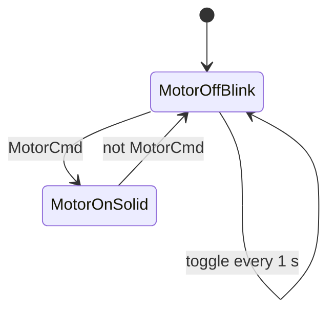

# Example - 2 Second Blinker

> [!info] Source spine
- [[Presentations/02_PLC_lecture_2025_4pp-2.pdf|Lecture 02 - Counters and literals]]
- [[Presentations/03_PLC_lecture_2023.pdf|Lecture 03 - Structuring tasks and interrupts]]
- [[Presentations/04_PLC_lecture_2025.pdf|Lecture 04 - LD programming issues]]
- [[Presentations/05_PLC_lecture_2025_ST_6pp.pdf|Lecture 05 - Structured Text]]
- [[Presentations/07_PLC_lecture_2025_hardware_6pp.pdf|Lecture 07 - Hardware]]
- [[Presentations/08_PLC_lecture_2025_SFC_6pp.pdf|Lecture 08 - SFC]]
- [[Presentations/09_PLC_lecture_2025_discret_6pp.pdf|Lecture 09 - Discrete control]]
- [[Presentations/PLC_lecture_2025_communication_ASi_IOLink.pdf|Communication - S7-1200, AS-i, IO-Link]]

## Problem Statement
Blink a light with period 2 s and 50 percent duty when the motor is off.

## Solution
Toggle a state bit every 1 s while Motor is FALSE; force the light TRUE while Motor is TRUE.

## Explanation
- A 2 s period with 50 percent duty means 1 s ON and 1 s OFF.
- When the motor turns on, the light is continuously on.
- Reset BlinkState if a known initial phase is required.

## Ladder Implementation
```text
| NOT Motor |----[ TON BlinkTimer, PT=T#1s ]
| BlinkTimer.Q |---- toggle BlinkState and reset timer
Light := Motor OR (NOT Motor AND BlinkState)
```

## Structured Text Implementation
```iecst
BlinkTimer(IN := NOT Motor AND NOT BlinkTimer.Q, PT := T#1s);
IF BlinkTimer.Q THEN
    BlinkState := NOT BlinkState;
END_IF;
Light := Motor OR ((NOT Motor) AND BlinkState);
```

## Alternative Implementations
- Use vendor-provided function blocks where they reduce risk.
- Use SFC or an explicit state machine when the example grows into a sequence.

## Full Working Code

### Mermaid Diagram


### Assumptions And I/O
- MotorCmd TRUE means the motor is running or commanded to run.
- When MotorCmd is FALSE, Light flashes with a 2 s period and 50 percent duty.
- One TON creates a 1 s half-period.

### Variable Declaration
```iecst
PROGRAM MotorLightBlinker
VAR_INPUT
    MotorCmd : BOOL;
END_VAR
VAR_OUTPUT
    Light : BOOL;
END_VAR
VAR
    BlinkState : BOOL;
    HalfPeriod : TON;
END_VAR
```

### Structured Text Program
```iecst
(* Input section *)
(* MotorCmd is the logical motor command. *)

(* Work section *)
HalfPeriod(IN := (NOT MotorCmd) AND (NOT HalfPeriod.Q), PT := T#1s);

IF MotorCmd THEN
    BlinkState := FALSE;
ELSIF HalfPeriod.Q THEN
    BlinkState := NOT BlinkState;
END_IF;

(* Output section *)
Light := MotorCmd OR ((NOT MotorCmd) AND BlinkState);
```

### Test Checklist
- MotorCmd TRUE makes Light continuously TRUE.
- MotorCmd FALSE toggles Light every 1 s.
- The visible blink period is 2 s.

## Related Concepts
- [[Periodic Signal Generation]]
- [[TON]]
- [[Task 4 - Motor Light Flashing]]
