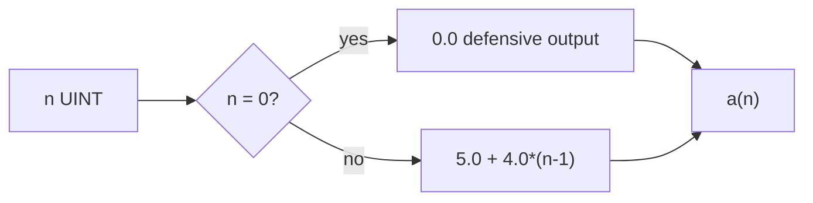

# Example - Arithmetic Sequence Function

> [!info] Source spine
- [[Presentations/02_PLC_lecture_2025_4pp-2.pdf|Lecture 02 - Counters and literals]]
- [[Presentations/03_PLC_lecture_2023.pdf|Lecture 03 - Structuring tasks and interrupts]]
- [[Presentations/04_PLC_lecture_2025.pdf|Lecture 04 - LD programming issues]]
- [[Presentations/05_PLC_lecture_2025_ST_6pp.pdf|Lecture 05 - Structured Text]]
- [[Presentations/07_PLC_lecture_2025_hardware_6pp.pdf|Lecture 07 - Hardware]]
- [[Presentations/08_PLC_lecture_2025_SFC_6pp.pdf|Lecture 08 - SFC]]
- [[Presentations/09_PLC_lecture_2025_discret_6pp.pdf|Lecture 09 - Discrete control]]
- [[Presentations/PLC_lecture_2025_communication_ASi_IOLink.pdf|Communication - S7-1200, AS-i, IO-Link]]

## Problem Statement
Return a(n) where a(1)=5.0 and a(n)=a(n-1)+4.0 for n>1.

## Solution
Recognize the closed form a(n)=5.0 + 4.0*(n-1).

## Explanation
- A FUNCTION is enough because no memory is required.
- The task says n is greater than 0, but defensive code can still handle zero.
- Do not implement recursion in a PLC unless the environment explicitly supports it.

## Ladder Implementation
```text
Not ideal in LD; use an ST function or FB.
```

## Structured Text Implementation
```iecst
FUNCTION SeqValue : REAL
VAR_INPUT
    n : UINT;
END_VAR
IF n = 0 THEN
    SeqValue := 0.0;
ELSE
    SeqValue := 5.0 + 4.0 * UINT_TO_REAL(n - 1);
END_IF;
```

## Alternative Implementations
- Use vendor-provided function blocks where they reduce risk.
- Use SFC or an explicit state machine when the example grows into a sequence.

## Full Working Code

### Mermaid Diagram


### Assumptions And I/O
- The mathematical task states n is greater than zero.
- A FUNCTION is enough because no state is needed.
- The defensive n=0 branch prevents underflow surprises.

### Variable Declaration
```iecst
FUNCTION SeqValue : REAL
VAR_INPUT
    n : UINT;
END_VAR
END_FUNCTION
```

### Structured Text Program
```iecst
(* Input section *)
(* n is the requested sequence index. *)

(* Work and output section *)
IF n = 0 THEN
    SeqValue := 0.0;
ELSE
    SeqValue := 5.0 + 4.0 * UINT_TO_REAL(n - 1);
END_IF;
```

### Test Checklist
- n = 1 returns 5.0.
- n = 2 returns 9.0.
- n = 5 returns 21.0.

## Related Concepts
- [[Reusable Function Block]]
- [[Structured Text (ST)]]
- [[Task 8 - Arithmetic Sequence Block]]
