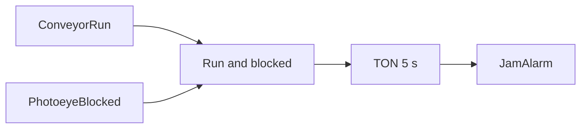

# Example - Conveyor Jam Timer

> [!info] Source spine
- [[Presentations/02_PLC_lecture_2025_4pp-2.pdf|Lecture 02 - Counters and literals]]
- [[Presentations/03_PLC_lecture_2023.pdf|Lecture 03 - Structuring tasks and interrupts]]
- [[Presentations/04_PLC_lecture_2025.pdf|Lecture 04 - LD programming issues]]
- [[Presentations/05_PLC_lecture_2025_ST_6pp.pdf|Lecture 05 - Structured Text]]
- [[Presentations/07_PLC_lecture_2025_hardware_6pp.pdf|Lecture 07 - Hardware]]
- [[Presentations/08_PLC_lecture_2025_SFC_6pp.pdf|Lecture 08 - SFC]]
- [[Presentations/09_PLC_lecture_2025_discret_6pp.pdf|Lecture 09 - Discrete control]]
- [[Presentations/PLC_lecture_2025_communication_ASi_IOLink.pdf|Communication - S7-1200, AS-i, IO-Link]]

## Problem Statement
Alarm if a sensor stays blocked too long while the conveyor is running.

## Solution
Run a TON when conveyor is commanded and blocked sensor is TRUE.

## Explanation
- Timer resets when the item clears or conveyor stops.
- Use a latched alarm if the operator must acknowledge it.
- Choose PT based on conveyor speed and item length.

## Ladder Implementation
```text
| ConveyorRun AND PhotoeyeBlocked |----[ TON JamTimer, PT=T#5s ]----( JamAlarm )
```

## Structured Text Implementation
```iecst
JamTimer(IN := ConveyorRun AND PhotoeyeBlocked, PT := T#5s);
JamAlarm := JamTimer.Q;
```

## Alternative Implementations
- Use vendor-provided function blocks where they reduce risk.
- Use SFC or an explicit state machine when the example grows into a sequence.

## Full Working Code

### Mermaid Diagram


### Assumptions And I/O
- The photoeye should normally clear before 5 s.
- The timer runs only while the conveyor is commanded on.
- The alarm is latched until acknowledge.

### Variable Declaration
```iecst
PROGRAM ConveyorJamTimer
VAR_INPUT
    ConveyorRun     : BOOL;
    PhotoeyeBlocked : BOOL;
    Ack             : BOOL;
END_VAR
VAR_OUTPUT
    JamAlarm : BOOL;
END_VAR
VAR
    JamTimer : TON;
END_VAR
```

### Structured Text Program
```iecst
(* Input section *)
JamTimer(IN := ConveyorRun AND PhotoeyeBlocked, PT := T#5s);

(* Work section *)
IF JamTimer.Q THEN
    JamAlarm := TRUE;
ELSIF Ack AND (NOT PhotoeyeBlocked) THEN
    JamAlarm := FALSE;
END_IF;

(* Output section *)
(* JamAlarm is sent to HMI or alarm handling logic. *)
```

### Test Checklist
- No alarm if the item clears before 5 s.
- Alarm latches after 5 s blocked while running.
- Ack clears only after PhotoeyeBlocked is FALSE.

## Related Concepts
- [[Conveyor Control]]
- [[TON]]
- [[Alarm Handling]]
