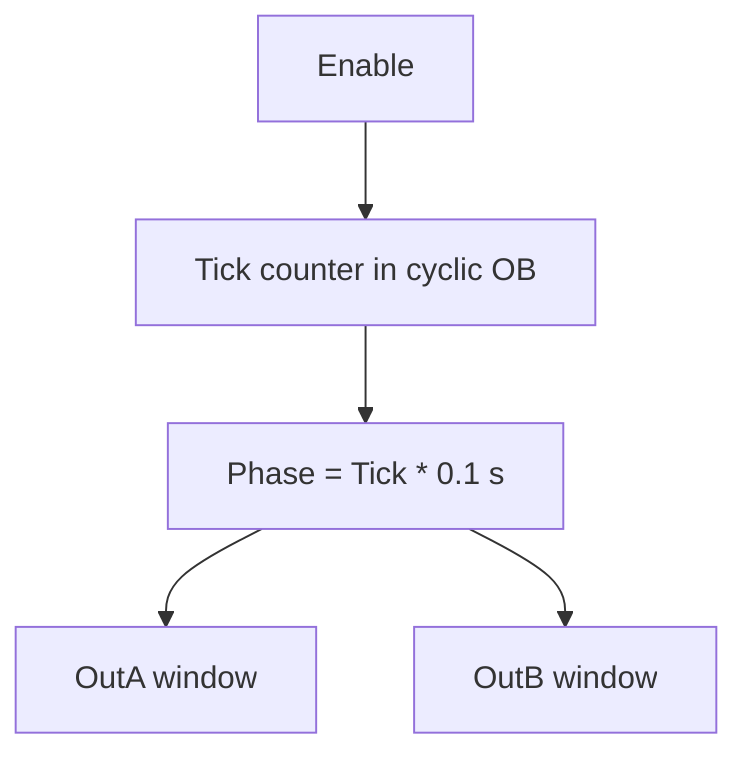

# Example - Cyclic Interrupt Pulse Pattern

> [!info] Source spine
- [[Presentations/02_PLC_lecture_2025_4pp-2.pdf|Lecture 02 - Counters and literals]]
- [[Presentations/03_PLC_lecture_2023.pdf|Lecture 03 - Structuring tasks and interrupts]]
- [[Presentations/04_PLC_lecture_2025.pdf|Lecture 04 - LD programming issues]]
- [[Presentations/05_PLC_lecture_2025_ST_6pp.pdf|Lecture 05 - Structured Text]]
- [[Presentations/07_PLC_lecture_2025_hardware_6pp.pdf|Lecture 07 - Hardware]]
- [[Presentations/08_PLC_lecture_2025_SFC_6pp.pdf|Lecture 08 - SFC]]
- [[Presentations/09_PLC_lecture_2025_discret_6pp.pdf|Lecture 09 - Discrete control]]
- [[Presentations/PLC_lecture_2025_communication_ASi_IOLink.pdf|Communication - S7-1200, AS-i, IO-Link]]

## Problem Statement
Generate timed windows from a 100 ms cyclic interrupt.

## Solution
Count ticks and map them to seconds.

## Explanation
- 160 ticks at 100 ms equals 16 s.
- OutA is TRUE for ticks 0..99, meaning 10 s.
- OutB is TRUE for ticks 20..39, meaning 2 s.

## Ladder Implementation
```text
Cyclic OB -> Tick counter -> comparison networks
```

## Structured Text Implementation
```iecst
IF Enable THEN
    Tick := Tick + 1; (* 100 ms *)
    IF Tick >= 160 THEN Tick := 0; END_IF;
ELSE
    Tick := 0;
END_IF;
OutA := Enable AND (Tick < 100);
OutB := Enable AND (Tick >= 20) AND (Tick < 40);
```

## Alternative Implementations
- Use vendor-provided function blocks where they reduce risk.
- Use SFC or an explicit state machine when the example grows into a sequence.

## Full Working Code

### Mermaid Diagram


### Assumptions And I/O
- The program is called from a 100 ms cyclic interrupt.
- The full cycle is 16 s, so 160 ticks.
- OutA and OutB are derived from tick windows.

### Variable Declaration
```iecst
PROGRAM CyclicPulsePattern
VAR_INPUT
    Enable : BOOL;
END_VAR
VAR_OUTPUT
    OutA : BOOL;
    OutB : BOOL;
END_VAR
VAR
    Tick : INT;
END_VAR
```

### Structured Text Program
```iecst
(* Input section *)
(* This program must be called every 100 ms. *)

(* Work section *)
IF Enable THEN
    Tick := Tick + 1;
    IF Tick >= 160 THEN
        Tick := 0;
    END_IF;
ELSE
    Tick := 0;
END_IF;

(* Output section *)
OutA := Enable AND (Tick < 100);                 (* 0.0 s to 10.0 s *)
OutB := Enable AND (Tick >= 20) AND (Tick < 40); (* 2.0 s to 4.0 s *)
```

### Test Checklist
- Enable FALSE resets Tick and both outputs.
- OutA is TRUE for 10 s per cycle.
- OutB is TRUE for 2 s per cycle.
- Changing the interrupt period requires recalculating tick limits.

## Related Concepts
- [[Cyclic Interrupt]]
- [[Cyclic Interrupt Pulse Generator]]
- [[Task 6 - Cyclic Interrupt Timing]]
