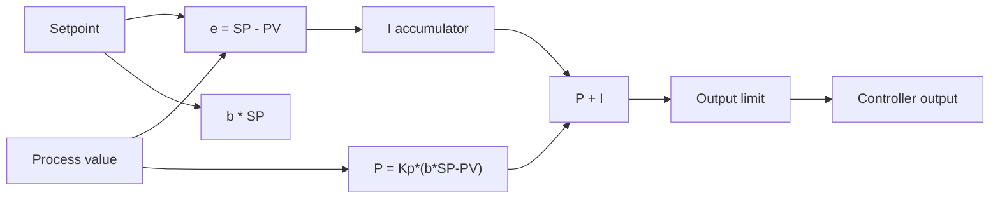

# Example - Digital PI Controller

> [!info] Source spine
- [[Presentations/02_PLC_lecture_2025_4pp-2.pdf|Lecture 02 - Counters and literals]]
- [[Presentations/03_PLC_lecture_2023.pdf|Lecture 03 - Structuring tasks and interrupts]]
- [[Presentations/04_PLC_lecture_2025.pdf|Lecture 04 - LD programming issues]]
- [[Presentations/05_PLC_lecture_2025_ST_6pp.pdf|Lecture 05 - Structured Text]]
- [[Presentations/07_PLC_lecture_2025_hardware_6pp.pdf|Lecture 07 - Hardware]]
- [[Presentations/08_PLC_lecture_2025_SFC_6pp.pdf|Lecture 08 - SFC]]
- [[Presentations/09_PLC_lecture_2025_discret_6pp.pdf|Lecture 09 - Discrete control]]
- [[Presentations/PLC_lecture_2025_communication_ASi_IOLink.pdf|Communication - S7-1200, AS-i, IO-Link]]

## Problem Statement
Implement a PI controller with output limits.

## Solution
Use proportional term plus accumulated integral with anti-windup.

## Explanation
- The weighting factor b usually affects the setpoint part of the proportional term.
- Integral anti-windup freezes integration when saturation would increase windup.
- Use a fixed sample time.

## Ladder Implementation
```text
Use a PID block or FBD/ST.
```

## Structured Text Implementation
```iecst
Error := SP - PV;
P := Kp * (B * SP - PV);
I_candidate := I + (Kp * Ts / Ti) * Error;
U_unsat := P + I_candidate;
U := LIMIT(MN := Umin, IN := U_unsat, MX := Umax);
IF U = U_unsat THEN
    I := I_candidate;
END_IF;
```

## Alternative Implementations
- Use vendor-provided function blocks where they reduce risk.
- Use SFC or an explicit state machine when the example grows into a sequence.

## Full Working Code

### Mermaid Diagram


### Assumptions And I/O
- The block is called at a fixed sample time Ts_s.
- b is proportional setpoint weighting.
- Integral update is frozen when output saturation would cause windup.

### Variable Declaration
```iecst
FUNCTION_BLOCK FB_DigitalPI
VAR_INPUT
    SP    : REAL;
    PV    : REAL;
    Kp    : REAL := 1.0;
    Ti_s  : REAL := 10.0;
    Ts_s  : REAL := 0.1;
    B     : REAL := 1.0;
    U_Min : REAL := 0.0;
    U_Max : REAL := 100.0;
    Reset : BOOL;
END_VAR
VAR_OUTPUT
    U     : REAL;
    Error : REAL;
END_VAR
VAR
    P           : REAL;
    I           : REAL;
    I_Candidate : REAL;
    U_Unlimited : REAL;
END_VAR
END_FUNCTION_BLOCK
```

### Structured Text Program
```iecst
(* Input section *)
Error := SP - PV;

(* Work section *)
IF Reset THEN
    I := 0.0;
END_IF;

P := Kp * (B * SP - PV);

IF Ti_s > 0.0 THEN
    I_Candidate := I + (Kp * Ts_s / Ti_s) * Error;
ELSE
    I_Candidate := I;
END_IF;

U_Unlimited := P + I_Candidate;
U := LIMIT(MN := U_Min, IN := U_Unlimited, MX := U_Max);

IF U = U_Unlimited THEN
    I := I_Candidate;
END_IF;

(* Output section *)
(* U is the limited actuator command. *)
```

### Test Checklist
- With Reset TRUE, the integral term returns to zero.
- U never exceeds U_Min..U_Max.
- The block must be called with constant Ts_s.
- When saturated, I does not keep increasing into windup.

## Related Concepts
- [[PID Control]]
- [[PID Control in PLC]]
- [[Task 10 - PI Controller With Weighting]]
