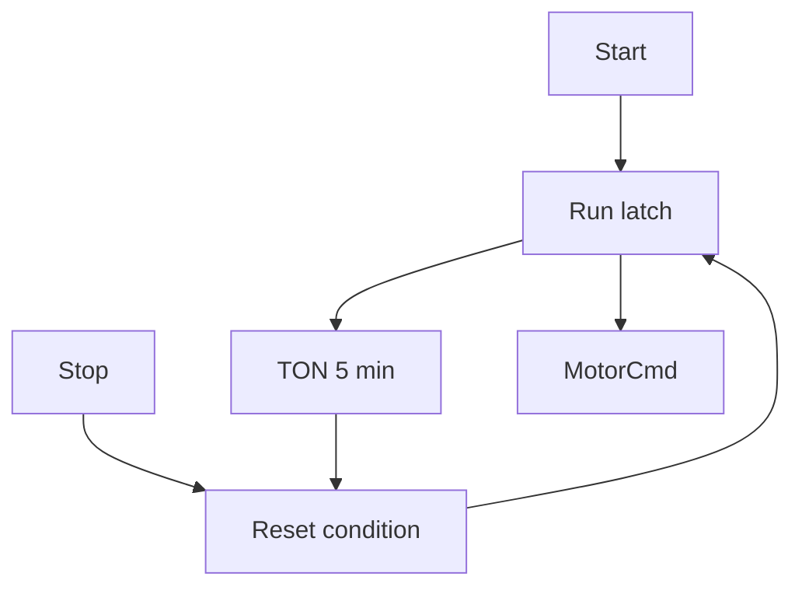

# Example - Five Minute Motor Limit

> [!info] Source spine
- [[Presentations/02_PLC_lecture_2025_4pp-2.pdf|Lecture 02 - Counters and literals]]
- [[Presentations/03_PLC_lecture_2023.pdf|Lecture 03 - Structuring tasks and interrupts]]
- [[Presentations/04_PLC_lecture_2025.pdf|Lecture 04 - LD programming issues]]
- [[Presentations/05_PLC_lecture_2025_ST_6pp.pdf|Lecture 05 - Structured Text]]
- [[Presentations/07_PLC_lecture_2025_hardware_6pp.pdf|Lecture 07 - Hardware]]
- [[Presentations/08_PLC_lecture_2025_SFC_6pp.pdf|Lecture 08 - SFC]]
- [[Presentations/09_PLC_lecture_2025_discret_6pp.pdf|Lecture 09 - Discrete control]]
- [[Presentations/PLC_lecture_2025_communication_ASi_IOLink.pdf|Communication - S7-1200, AS-i, IO-Link]]

## Problem Statement
Stop a motor automatically after 5 minutes of running.

## Solution
Run a TON while Motor is TRUE and reset the latch when the timer is done.

## Explanation
- The timer accumulates only while Motor is TRUE.
- Stop can end the run earlier.
- After timeout, a fresh Start should be required.

## Ladder Implementation
```text
| Motor |----[ TON RunLimit, PT=T#5m ]
| Stop OR RunLimit.Q |----(R MotorLatch)
```

## Structured Text Implementation
```iecst
RunLimit(IN := Motor, PT := T#5m);
IF StopPressed OR RunLimit.Q THEN
    MotorLatch := FALSE;
ELSIF StartPressed THEN
    MotorLatch := TRUE;
END_IF;
Motor := MotorLatch;
```

## Alternative Implementations
- Use vendor-provided function blocks where they reduce risk.
- Use SFC or an explicit state machine when the example grows into a sequence.

## Full Working Code

### Mermaid Diagram


### Assumptions And I/O
- StartPressed is a logical TRUE pulse or level from the start button.
- StopPressed is TRUE when the operator requests stop.
- The motor is allowed to run for one continuous 5 minute interval.
- A fresh start is required after timeout.

### Variable Declaration
```iecst
PROGRAM FiveMinuteMotorLimit
VAR_INPUT
    StartPressed : BOOL;
    StopPressed  : BOOL;
    InterlockOK  : BOOL;
END_VAR
VAR_OUTPUT
    MotorCmd      : BOOL;
    TimedOut      : BOOL;
    Remaining_s   : REAL;
END_VAR
VAR
    RunLatch : BOOL;
    RunLimit : TON;
END_VAR
```

### Structured Text Program
```iecst
(* Input section *)
(* InterlockOK should include stop chain, overload, and permissives. *)

(* Work section *)
RunLimit(IN := RunLatch, PT := T#5m);
TimedOut := RunLimit.Q;

IF StopPressed OR (NOT InterlockOK) OR TimedOut THEN
    RunLatch := FALSE;
ELSIF StartPressed AND InterlockOK THEN
    RunLatch := TRUE;
END_IF;

Remaining_s := 300.0 - TIME_TO_REAL(RunLimit.ET) / 1000.0;
IF Remaining_s < 0.0 THEN
    Remaining_s := 0.0;
END_IF;

(* Output section *)
MotorCmd := RunLatch AND InterlockOK;
```

### Test Checklist
- Motor starts when StartPressed is TRUE and InterlockOK is TRUE.
- Motor stops immediately on StopPressed.
- Motor stops automatically after 5 minutes.
- Remaining_s never goes below zero.

## Related Concepts
- [[Motor Run Time Limit]]
- [[TON]]
- [[Task 3 - Motor Run Time Limit]]
