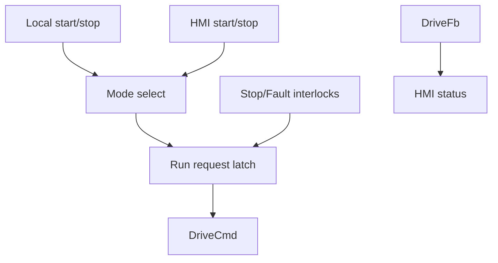

# Example - HMI Drive Command Arbitration

> [!info] Source spine
- [[Presentations/02_PLC_lecture_2025_4pp-2.pdf|Lecture 02 - Counters and literals]]
- [[Presentations/03_PLC_lecture_2023.pdf|Lecture 03 - Structuring tasks and interrupts]]
- [[Presentations/04_PLC_lecture_2025.pdf|Lecture 04 - LD programming issues]]
- [[Presentations/05_PLC_lecture_2025_ST_6pp.pdf|Lecture 05 - Structured Text]]
- [[Presentations/07_PLC_lecture_2025_hardware_6pp.pdf|Lecture 07 - Hardware]]
- [[Presentations/08_PLC_lecture_2025_SFC_6pp.pdf|Lecture 08 - SFC]]
- [[Presentations/09_PLC_lecture_2025_discret_6pp.pdf|Lecture 09 - Discrete control]]
- [[Presentations/PLC_lecture_2025_communication_ASi_IOLink.pdf|Communication - S7-1200, AS-i, IO-Link]]

## Problem Statement
Add HMI manual control to a motor/drive while preserving stop and fault dominance.

## Solution
Choose one command source by mode, then apply common interlocks.

## Explanation
- Mode selection should be visible on HMI.
- Display feedback separately from command.
- A real emergency stop remains hardwired/safety-rated.

## Ladder Implementation
```text
Mode select -> command mux -> StopOK/FaultOK -> DriveEnable
```

## Structured Text Implementation
```iecst
CASE Mode OF
0: RequestedRun := LocalStart OR (RequestedRun AND NOT LocalStop);
1: RequestedRun := HMI_Start OR (RequestedRun AND NOT HMI_Stop);
END_CASE;
DriveEnable := RequestedRun AND StopOK AND NOT Fault;
Status_RunCmd := DriveEnable;
Status_RunFb := DriveFeedback;
Status_Fault := Fault;
```

## Alternative Implementations
- Use vendor-provided function blocks where they reduce risk.
- Use SFC or an explicit state machine when the example grows into a sequence.

## Full Working Code

### Mermaid Diagram


### Assumptions And I/O
- LocalMode FALSE means HMI mode; TRUE means local mode.
- Stop and fault interlocks dominate both modes.
- Command and feedback are displayed separately.

### Variable Declaration
```iecst
PROGRAM HMIDriveCommandArbitration
VAR_INPUT
    LocalMode     : BOOL;
    LocalStart    : BOOL;
    LocalStop     : BOOL;
    HMI_Start     : BOOL;
    HMI_Stop      : BOOL;
    StopOK        : BOOL;
    FaultOK       : BOOL;
    DriveFeedback : BOOL;
END_VAR
VAR_OUTPUT
    DriveCmd        : BOOL;
    HMI_Commanded   : BOOL;
    HMI_Running     : BOOL;
    HMI_FaultActive : BOOL;
END_VAR
VAR
    StartCmd   : BOOL;
    StopCmd    : BOOL;
    RunRequest : BOOL;
END_VAR
```

### Structured Text Program
```iecst
(* Input section *)
IF LocalMode THEN
    StartCmd := LocalStart;
    StopCmd := LocalStop;
ELSE
    StartCmd := HMI_Start;
    StopCmd := HMI_Stop;
END_IF;

(* Work section *)
IF StopCmd OR (NOT StopOK) OR (NOT FaultOK) THEN
    RunRequest := FALSE;
ELSIF StartCmd THEN
    RunRequest := TRUE;
END_IF;

(* Output section *)
DriveCmd := RunRequest AND StopOK AND FaultOK;
HMI_Commanded := DriveCmd;
HMI_Running := DriveFeedback;
HMI_FaultActive := NOT FaultOK;
```

### Test Checklist
- A stop in either selected mode resets RunRequest.
- FaultOK FALSE forces DriveCmd FALSE.
- HMI_Running follows feedback, not the command.

## Related Concepts
- [[HMI Manual Control]]
- [[Task 15 - HMI Drive Control]]
- [[Emergency Stop]]
