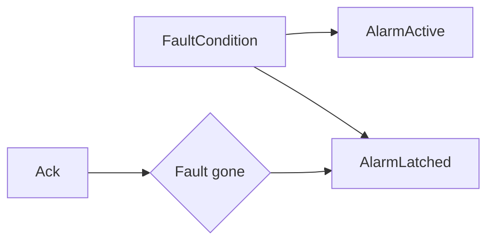

# Example - Latched Alarm With Acknowledge

> [!info] Source spine
- [[Presentations/02_PLC_lecture_2025_4pp-2.pdf|Lecture 02 - Counters and literals]]
- [[Presentations/03_PLC_lecture_2023.pdf|Lecture 03 - Structuring tasks and interrupts]]
- [[Presentations/04_PLC_lecture_2025.pdf|Lecture 04 - LD programming issues]]
- [[Presentations/05_PLC_lecture_2025_ST_6pp.pdf|Lecture 05 - Structured Text]]
- [[Presentations/07_PLC_lecture_2025_hardware_6pp.pdf|Lecture 07 - Hardware]]
- [[Presentations/08_PLC_lecture_2025_SFC_6pp.pdf|Lecture 08 - SFC]]
- [[Presentations/09_PLC_lecture_2025_discret_6pp.pdf|Lecture 09 - Discrete control]]
- [[Presentations/PLC_lecture_2025_communication_ASi_IOLink.pdf|Communication - S7-1200, AS-i, IO-Link]]

## Problem Statement
Latch an alarm when a fault appears and clear it only after the fault is gone and acknowledged.

## Solution
Use separate active, latched, and acknowledge conditions.

## Explanation
- The operator can see that a fault happened even if it clears quickly.
- Acknowledgement should not hide an active dangerous condition.
- Use edge detection for acknowledge buttons if required.

## Ladder Implementation
```text
FaultCondition -> SET AlarmLatched; Ack AND NOT FaultCondition -> RESET AlarmLatched
```

## Structured Text Implementation
```iecst
IF FaultCondition THEN
    AlarmLatched := TRUE;
END_IF;
IF Ack AND NOT FaultCondition THEN
    AlarmLatched := FALSE;
END_IF;
AlarmActive := FaultCondition;
AlarmVisible := AlarmLatched;
```

## Alternative Implementations
- Use vendor-provided function blocks where they reduce risk.
- Use SFC or an explicit state machine when the example grows into a sequence.

## Full Working Code

### Mermaid Diagram


### Assumptions And I/O
- FaultCondition can be short or continuous.
- The alarm remains visible until acknowledged after the fault clears.
- AlarmActive and AlarmLatched have different meanings.

### Variable Declaration
```iecst
PROGRAM LatchedAlarmWithAcknowledge
VAR_INPUT
    FaultCondition : BOOL;
    Ack            : BOOL;
END_VAR
VAR_OUTPUT
    AlarmActive  : BOOL;
    AlarmLatched : BOOL;
END_VAR
```

### Structured Text Program
```iecst
(* Input section *)
AlarmActive := FaultCondition;

(* Work section *)
IF FaultCondition THEN
    AlarmLatched := TRUE;
ELSIF Ack THEN
    AlarmLatched := FALSE;
END_IF;

(* Output section *)
(* AlarmActive is current; AlarmLatched is memory for HMI. *)
```

### Test Checklist
- FaultCondition TRUE sets both active and latched indications.
- Ack does not clear while FaultCondition is TRUE.
- Ack clears latched alarm after the condition is gone.

## Related Concepts
- [[Alarm Handling]]
- [[SET]]
- [[RESET]]
