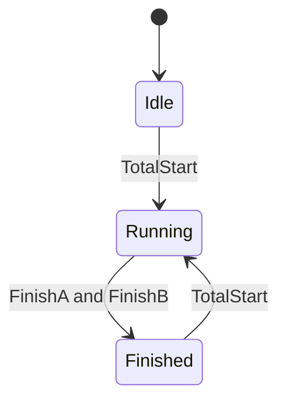

# Example - Parallel SFC Processes

> [!info] Source spine
- [[Presentations/02_PLC_lecture_2025_4pp-2.pdf|Lecture 02 - Counters and literals]]
- [[Presentations/03_PLC_lecture_2023.pdf|Lecture 03 - Structuring tasks and interrupts]]
- [[Presentations/04_PLC_lecture_2025.pdf|Lecture 04 - LD programming issues]]
- [[Presentations/05_PLC_lecture_2025_ST_6pp.pdf|Lecture 05 - Structured Text]]
- [[Presentations/07_PLC_lecture_2025_hardware_6pp.pdf|Lecture 07 - Hardware]]
- [[Presentations/08_PLC_lecture_2025_SFC_6pp.pdf|Lecture 08 - SFC]]
- [[Presentations/09_PLC_lecture_2025_discret_6pp.pdf|Lecture 09 - Discrete control]]
- [[Presentations/PLC_lecture_2025_communication_ASi_IOLink.pdf|Communication - S7-1200, AS-i, IO-Link]]

## Problem Statement
Start Process A and Process B concurrently, then set TotalFinish after both are done.

## Solution
Use parallel branches or two state machines with a common finish join.

## Explanation
- SFC is clearer because parallel branches and synchronization are explicit.
- Do not set TotalFinish after only one branch finishes.
- Define reset/restart behavior.

## Ladder Implementation
```text
TotalStart -> branch A StartA and branch B StartB; FinishA AND FinishB -> TotalFinish
```

## Structured Text Implementation
```iecst
CASE State OF
0: IF TotalStart THEN StartA := TRUE; StartB := TRUE; State := 10; END_IF;
10: IF FinishA AND FinishB THEN StartA := FALSE; StartB := FALSE; TotalFinish := TRUE; State := 20; END_IF;
20: IF Reset THEN TotalFinish := FALSE; State := 0; END_IF;
END_CASE;
```

## Alternative Implementations
- Use vendor-provided function blocks where they reduce risk.
- Use SFC or an explicit state machine when the example grows into a sequence.

## Full Working Code

### Mermaid Diagram


### Assumptions And I/O
- Process A and B start together.
- Each process reports its own finish bit.
- TotalFinish is TRUE only after both finish.

### Variable Declaration
```iecst
PROGRAM ParallelSFCProcesses
VAR_INPUT
    TotalStart : BOOL;
    FinishA    : BOOL;
    FinishB    : BOOL;
END_VAR
VAR_OUTPUT
    StartA      : BOOL;
    StartB      : BOOL;
    TotalFinish : BOOL;
END_VAR
VAR
    State : INT := 0;
END_VAR
```

### Structured Text Program
```iecst
(* Input section *)
(* TotalStart is a command to begin both processes. *)

(* Work section *)
CASE State OF
0:
    TotalFinish := FALSE;
    IF TotalStart THEN
        State := 10;
    END_IF;
10:
    IF FinishA AND FinishB THEN
        State := 20;
    END_IF;
20:
    TotalFinish := TRUE;
    IF TotalStart THEN
        TotalFinish := FALSE;
        State := 10;
    END_IF;
END_CASE;

(* Output section *)
StartA := State = 10;
StartB := State = 10;
```

### Test Checklist
- TotalStart moves the sequence out of Idle.
- StartA and StartB are TRUE while Running.
- TotalFinish waits for both FinishA and FinishB.

## Related Concepts
- [[Sequential Machine]]
- [[Sequential Function Chart (SFC)]]
- [[Task 12 - Parallel SFC Processes]]
