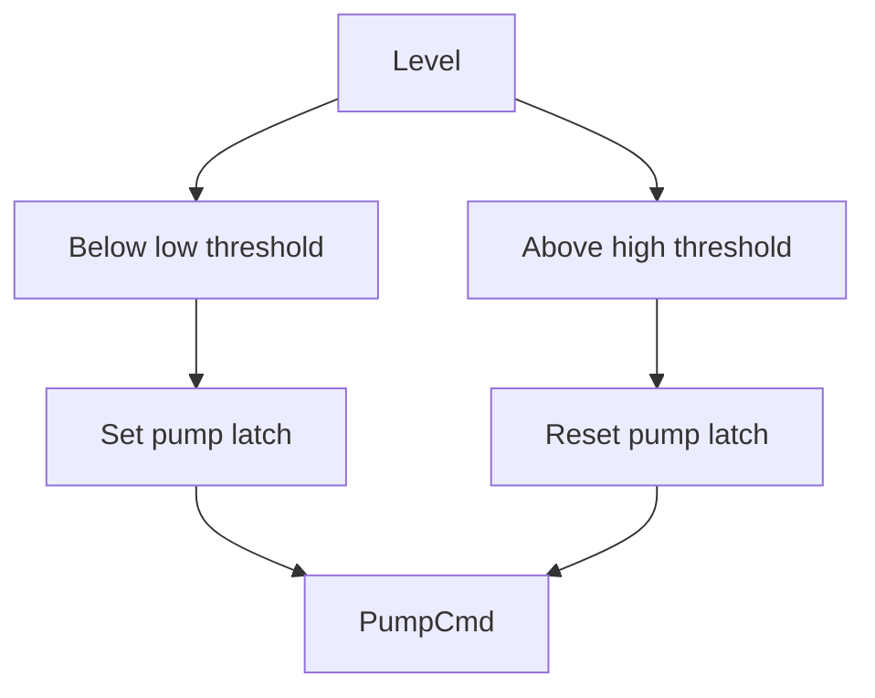

# Example - Pump With Hysteresis

> [!info] Source spine
- [[Presentations/02_PLC_lecture_2025_4pp-2.pdf|Lecture 02 - Counters and literals]]
- [[Presentations/03_PLC_lecture_2023.pdf|Lecture 03 - Structuring tasks and interrupts]]
- [[Presentations/04_PLC_lecture_2025.pdf|Lecture 04 - LD programming issues]]
- [[Presentations/05_PLC_lecture_2025_ST_6pp.pdf|Lecture 05 - Structured Text]]
- [[Presentations/07_PLC_lecture_2025_hardware_6pp.pdf|Lecture 07 - Hardware]]
- [[Presentations/08_PLC_lecture_2025_SFC_6pp.pdf|Lecture 08 - SFC]]
- [[Presentations/09_PLC_lecture_2025_discret_6pp.pdf|Lecture 09 - Discrete control]]
- [[Presentations/PLC_lecture_2025_communication_ASi_IOLink.pdf|Communication - S7-1200, AS-i, IO-Link]]

## Problem Statement
Start pump below low threshold and stop above high threshold.

## Solution
Use a latch with two thresholds.

## Explanation
- Hysteresis prevents chatter around one threshold.
- Add dry-run and overload interlocks.
- Use scaled engineering units.

## Ladder Implementation
```text
Level < Low -> SET Pump; Level > High -> RESET Pump
```

## Structured Text Implementation
```iecst
IF Level < LowLevel THEN
    PumpRun := TRUE;
ELSIF Level > HighLevel THEN
    PumpRun := FALSE;
END_IF;
```

## Alternative Implementations
- Use vendor-provided function blocks where they reduce risk.
- Use SFC or an explicit state machine when the example grows into a sequence.

## Full Working Code

### Mermaid Diagram


### Assumptions And I/O
- LevelPercent is already scaled.
- Low and high thresholds prevent chatter.
- FaultOK and AutoMode must permit running.

### Variable Declaration
```iecst
PROGRAM PumpWithHysteresis
VAR_INPUT
    LevelPercent : REAL;
    AutoMode     : BOOL;
    FaultOK      : BOOL;
END_VAR
VAR_OUTPUT
    PumpCmd : BOOL;
END_VAR
VAR
    PumpLatch : BOOL;
END_VAR
```

### Structured Text Program
```iecst
(* Input section *)
(* LevelPercent is 0.0 to 100.0 percent. *)

(* Work section *)
IF (NOT AutoMode) OR (NOT FaultOK) THEN
    PumpLatch := FALSE;
ELSIF LevelPercent < 30.0 THEN
    PumpLatch := TRUE;
ELSIF LevelPercent > 80.0 THEN
    PumpLatch := FALSE;
END_IF;

(* Output section *)
PumpCmd := PumpLatch AND AutoMode AND FaultOK;
```

### Test Checklist
- Level below 30 percent starts the pump.
- Level above 80 percent stops it.
- Between 30 and 80 percent, the state is retained.

## Related Concepts
- [[Pump Control]]
- [[Analog Scaling]]
- [[COMPARE]]
