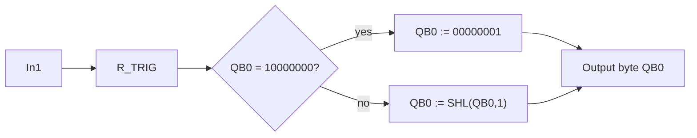

# Example - Running Light Byte

> [!info] Source spine
- [[Presentations/02_PLC_lecture_2025_4pp-2.pdf|Lecture 02 - Counters and literals]]
- [[Presentations/03_PLC_lecture_2023.pdf|Lecture 03 - Structuring tasks and interrupts]]
- [[Presentations/04_PLC_lecture_2025.pdf|Lecture 04 - LD programming issues]]
- [[Presentations/05_PLC_lecture_2025_ST_6pp.pdf|Lecture 05 - Structured Text]]
- [[Presentations/07_PLC_lecture_2025_hardware_6pp.pdf|Lecture 07 - Hardware]]
- [[Presentations/08_PLC_lecture_2025_SFC_6pp.pdf|Lecture 08 - SFC]]
- [[Presentations/09_PLC_lecture_2025_discret_6pp.pdf|Lecture 09 - Discrete control]]
- [[Presentations/PLC_lecture_2025_communication_ASi_IOLink.pdf|Communication - S7-1200, AS-i, IO-Link]]

## Problem Statement
Shift one active bit left in QB0 on each rising edge and wrap at the end.

## Solution
Use R_TRIG and SHL with explicit wrap.

## Explanation
- The rising edge prevents one button press from shifting many times.
- The zero check recovers from invalid state.
- Only one bit is TRUE if initialization and wrap are correct.

## Ladder Implementation
```text
In1 -> R_TRIG -> IF QB0=128 THEN MOVE 1 ELSE SHL
```

## Structured Text Implementation
```iecst
Edge(CLK := In1);
IF Init OR (QB0 = 0) THEN
    QB0 := 2#00000001;
ELSIF Edge.Q THEN
    IF QB0 = 2#10000000 THEN
        QB0 := 2#00000001;
    ELSE
        QB0 := SHL(IN := QB0, N := 1);
    END_IF;
END_IF;
```

## Alternative Implementations
- Use vendor-provided function blocks where they reduce risk.
- Use SFC or an explicit state machine when the example grows into a sequence.

## Full Working Code

### Mermaid Diagram


### Assumptions And I/O
- One and only one bit should be TRUE in QB0.
- In1 can be held down; shifting happens only on the rising edge.
- QB0 is initialized to the rightmost bit.

### Variable Declaration
```iecst
PROGRAM RunningLightByte
VAR_INPUT
    In1   : BOOL;
    Reset : BOOL;
END_VAR
VAR_OUTPUT
    QB0_Out : BYTE;
END_VAR
VAR
    QB0      : BYTE := 2#00000001;
    In1Edge  : R_TRIG;
END_VAR
```

### Structured Text Program
```iecst
(* Input section *)
In1Edge(CLK := In1);

(* Work section *)
IF Reset OR (QB0 = 0) THEN
    QB0 := 2#00000001;
ELSIF In1Edge.Q THEN
    IF QB0 = 2#10000000 THEN
        QB0 := 2#00000001;
    ELSE
        QB0 := SHL(IN := QB0, N := 1);
    END_IF;
END_IF;

(* Output section *)
QB0_Out := QB0;
```

### Test Checklist
- After reset, QB0_Out is 2#00000001.
- Each rising edge moves the bit left by one.
- After 2#10000000, the next rising edge wraps to 2#00000001.
- Holding In1 TRUE does not shift repeatedly.

## Related Concepts
- [[One Bit Shift Register]]
- [[R_TRIG]]
- [[SHL]]
- [[Task 11 - One Bit Shift Register]]
