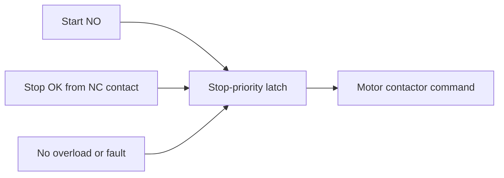

# Example - Stop Priority Motor Latch

> [!info] Source spine
- [[Presentations/02_PLC_lecture_2025_4pp-2.pdf|Lecture 02 - Counters and literals]]
- [[Presentations/03_PLC_lecture_2023.pdf|Lecture 03 - Structuring tasks and interrupts]]
- [[Presentations/04_PLC_lecture_2025.pdf|Lecture 04 - LD programming issues]]
- [[Presentations/05_PLC_lecture_2025_ST_6pp.pdf|Lecture 05 - Structured Text]]
- [[Presentations/07_PLC_lecture_2025_hardware_6pp.pdf|Lecture 07 - Hardware]]
- [[Presentations/08_PLC_lecture_2025_SFC_6pp.pdf|Lecture 08 - SFC]]
- [[Presentations/09_PLC_lecture_2025_discret_6pp.pdf|Lecture 09 - Discrete control]]
- [[Presentations/PLC_lecture_2025_communication_ASi_IOLink.pdf|Communication - S7-1200, AS-i, IO-Link]]

## Problem Statement
Start a motor with Start, stop with Stop, and guarantee Stop wins if both are pressed.

## Solution
Use a boolean latch expression where Stop is in series with the whole run request.

## Explanation
- If StopOK is FALSE, Motor becomes FALSE regardless of Start.
- This is stop-priority seal-in logic.
- Use a contactor feedback and overload/fault interlock in real systems.

## Ladder Implementation
```text
| StopOK |----+----| Start |--------( Motor )
              |
              +----| Motor |--------
```

## Structured Text Implementation
```iecst
Motor := StopOK AND (Start OR Motor);
```

## Alternative Implementations
- Use vendor-provided function blocks where they reduce risk.
- Use SFC or an explicit state machine when the example grows into a sequence.

## Full Working Code

### Mermaid Diagram


### Assumptions And I/O
- Start is TRUE while the start pushbutton is pressed.
- StopOK is TRUE when the NC stop circuit is healthy and not pressed.
- FaultOK is TRUE when overload and interlocks allow running.
- MotorCmd drives a relay or contactor coil, not the motor power circuit directly.

### Variable Declaration
```iecst
PROGRAM MotorLatch
VAR_INPUT
    Start   : BOOL;
    StopOK  : BOOL;
    FaultOK : BOOL;
END_VAR
VAR_OUTPUT
    MotorCmd : BOOL;
END_VAR
VAR
    RunLatch : BOOL;
END_VAR
```

### Structured Text Program
```iecst
(* Input section *)
(* Start, StopOK and FaultOK are already normalized as logical tags. *)

(* Work section: stop and fault have priority over start. *)
RunLatch := StopOK AND FaultOK AND (Start OR RunLatch);

(* Output section *)
MotorCmd := RunLatch;
```

### Ladder Version
```text
Network 1 - stop-priority seal-in
| StopOK |--| FaultOK |--+--| Start    |----( MotorCmd )
                         |
                         +--| MotorCmd |
```

### Test Checklist
- Start TRUE and StopOK TRUE sets MotorCmd TRUE.
- StopOK FALSE forces MotorCmd FALSE even if Start is TRUE.
- FaultOK FALSE forces MotorCmd FALSE.
- Releasing Start keeps MotorCmd TRUE until StopOK or FaultOK becomes FALSE.

## Related Concepts
- [[Motor Start-Stop]]
- [[Start-Stop Latch]]
- [[Task 2 - Start Stop Motor]]
