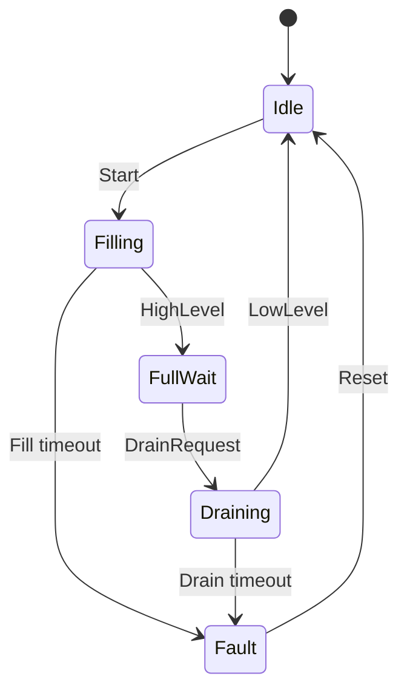

# Example - Tank Fill Sequence

> [!info] Source spine
- [[Presentations/02_PLC_lecture_2025_4pp-2.pdf|Lecture 02 - Counters and literals]]
- [[Presentations/03_PLC_lecture_2023.pdf|Lecture 03 - Structuring tasks and interrupts]]
- [[Presentations/04_PLC_lecture_2025.pdf|Lecture 04 - LD programming issues]]
- [[Presentations/05_PLC_lecture_2025_ST_6pp.pdf|Lecture 05 - Structured Text]]
- [[Presentations/07_PLC_lecture_2025_hardware_6pp.pdf|Lecture 07 - Hardware]]
- [[Presentations/08_PLC_lecture_2025_SFC_6pp.pdf|Lecture 08 - SFC]]
- [[Presentations/09_PLC_lecture_2025_discret_6pp.pdf|Lecture 09 - Discrete control]]
- [[Presentations/PLC_lecture_2025_communication_ASi_IOLink.pdf|Communication - S7-1200, AS-i, IO-Link]]

## Problem Statement
Fill a tank until high level, then drain until low level.

## Solution
Use states Idle, Filling, FullWait, Draining, and Fault.

## Explanation
- Only one state owns each valve command.
- Add timeouts for sensor failures.
- SFC is a good representation of the same logic.

## Ladder Implementation
```text
State bits drive FillValve and DrainValve; timers check for timeout.
```

## Structured Text Implementation
```iecst
CASE State OF
0: IF Start THEN State := 10; END_IF;
10: FillValve := TRUE; IF HighLevel THEN State := 20; END_IF;
20: FillValve := FALSE; IF DrainRequest THEN State := 30; END_IF;
30: DrainValve := TRUE; IF LowLevel THEN State := 0; END_IF;
END_CASE;
```

## Alternative Implementations
- Use vendor-provided function blocks where they reduce risk.
- Use SFC or an explicit state machine when the example grows into a sequence.

## Full Working Code

### Mermaid Diagram


### Assumptions And I/O
- HighLevel and LowLevel are digital level switches.
- FillValve and DrainValve must not be TRUE at the same time.
- Timeouts detect sensor or valve faults.

### Variable Declaration
```iecst
PROGRAM TankFillSequence
VAR_INPUT
    Start        : BOOL;
    DrainRequest : BOOL;
    HighLevel    : BOOL;
    LowLevel     : BOOL;
    Reset        : BOOL;
END_VAR
VAR_OUTPUT
    FillValve  : BOOL;
    DrainValve : BOOL;
    Fault      : BOOL;
    StateNo    : INT;
END_VAR
VAR
    State       : INT := 0;
    StepTimeout : TON;
END_VAR
```

### Structured Text Program
```iecst
(* Input section *)
(* Digital level switches are used directly as logical conditions. *)

(* Work section *)
StateNo := State;
StepTimeout(IN := (State = 10) OR (State = 30), PT := T#30s);

CASE State OF
0: (* Idle *)
    IF Start THEN
        State := 10;
    END_IF;

10: (* Filling *)
    IF HighLevel THEN
        State := 20;
    ELSIF StepTimeout.Q THEN
        State := 90;
    END_IF;

20: (* Full wait *)
    IF DrainRequest THEN
        State := 30;
    END_IF;

30: (* Draining *)
    IF LowLevel THEN
        State := 0;
    ELSIF StepTimeout.Q THEN
        State := 90;
    END_IF;

90: (* Fault *)
    IF Reset THEN
        State := 0;
    END_IF;
END_CASE;

(* Output section *)
FillValve := State = 10;
DrainValve := State = 30;
Fault := State = 90;
```

### Test Checklist
- Start moves Idle to Filling.
- HighLevel closes FillValve and moves to FullWait.
- DrainRequest opens DrainValve.
- Timeout creates Fault.

## Related Concepts
- [[Tank Filling]]
- [[Sequential Programming]]
- [[TON]]
