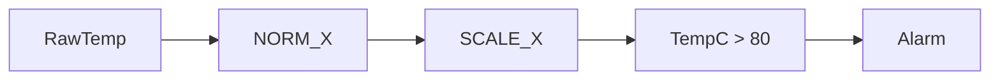

# Example - Temperature Alarm Threshold

> [!info] Source spine
- [[Presentations/02_PLC_lecture_2025_4pp-2.pdf|Lecture 02 - Counters and literals]]
- [[Presentations/03_PLC_lecture_2023.pdf|Lecture 03 - Structuring tasks and interrupts]]
- [[Presentations/04_PLC_lecture_2025.pdf|Lecture 04 - LD programming issues]]
- [[Presentations/05_PLC_lecture_2025_ST_6pp.pdf|Lecture 05 - Structured Text]]
- [[Presentations/07_PLC_lecture_2025_hardware_6pp.pdf|Lecture 07 - Hardware]]
- [[Presentations/08_PLC_lecture_2025_SFC_6pp.pdf|Lecture 08 - SFC]]
- [[Presentations/09_PLC_lecture_2025_discret_6pp.pdf|Lecture 09 - Discrete control]]
- [[Presentations/PLC_lecture_2025_communication_ASi_IOLink.pdf|Communication - S7-1200, AS-i, IO-Link]]

## Problem Statement
Raise an alarm when measured temperature is above 80 C.

## Solution
Scale the analog channel and compare in engineering units.

## Explanation
- The lecture material covers RTD, thermocouple, thermistor, and digital sensors.
- Use module-specific scaling for real hardware.
- For control, feed the scaled PV to PID.

## Ladder Implementation
```text
RawTemp -> scale -> TempC > 80.0 -> Alarm
```

## Structured Text Implementation
```iecst
TempC := SCALE_X(MIN := 0.0, VALUE := NormTemp, MAX := 150.0);
HighTemp := TempC > 80.0;
```

## Alternative Implementations
- Use vendor-provided function blocks where they reduce risk.
- Use SFC or an explicit state machine when the example grows into a sequence.

## Full Working Code

### Mermaid Diagram


### Assumptions And I/O
- The raw value comes from an analog temperature channel.
- The example scales 0..27648 to 0..150 C.
- The alarm threshold is 80 C.

### Variable Declaration
```iecst
PROGRAM TemperatureAlarmThreshold
VAR_INPUT
    RawTemp : INT;
END_VAR
VAR_OUTPUT
    TempC     : REAL;
    HighAlarm : BOOL;
END_VAR
VAR
    Norm : REAL;
END_VAR
```

### Structured Text Program
```iecst
(* Input section *)
Norm := NORM_X(MIN := 0, VALUE := RawTemp, MAX := 27648);
Norm := LIMIT(MN := 0.0, IN := Norm, MX := 1.0);
TempC := SCALE_X(MIN := 0.0, VALUE := Norm, MAX := 150.0);

(* Work section *)
HighAlarm := TempC > 80.0;

(* Output section *)
(* TempC is shown on HMI; HighAlarm is the alarm bit. *)
```

### Test Checklist
- RawTemp = 0 gives TempC = 0 C.
- TempC above 80 C sets HighAlarm.
- Out-of-range raw values are clamped through Norm.

## Related Concepts
- [[Temperature Measurement]]
- [[Analog Scaling]]
- [[PID Control]]
