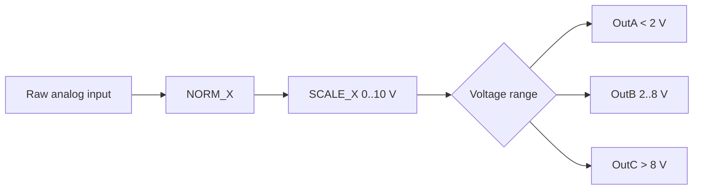

# Example - Three Range Analog Output

> [!info] Source spine
- [[Presentations/02_PLC_lecture_2025_4pp-2.pdf|Lecture 02 - Counters and literals]]
- [[Presentations/03_PLC_lecture_2023.pdf|Lecture 03 - Structuring tasks and interrupts]]
- [[Presentations/04_PLC_lecture_2025.pdf|Lecture 04 - LD programming issues]]
- [[Presentations/05_PLC_lecture_2025_ST_6pp.pdf|Lecture 05 - Structured Text]]
- [[Presentations/07_PLC_lecture_2025_hardware_6pp.pdf|Lecture 07 - Hardware]]
- [[Presentations/08_PLC_lecture_2025_SFC_6pp.pdf|Lecture 08 - SFC]]
- [[Presentations/09_PLC_lecture_2025_discret_6pp.pdf|Lecture 09 - Discrete control]]
- [[Presentations/PLC_lecture_2025_communication_ASi_IOLink.pdf|Communication - S7-1200, AS-i, IO-Link]]

## Problem Statement
Turn on OutA if voltage < 2 V, OutB if 2..8 V, OutC if > 8 V.

## Solution
Scale raw input to volts and use exclusive comparisons.

## Explanation
- The ranges cover all normal values once.
- If the signal is noisy, add hysteresis around 2 V and 8 V.
- Raw range 27648 is typical in Siemens examples; confirm module configuration.

## Ladder Implementation
```text
RawAI -> NORM_X -> SCALE_X -> comparators -> OutA/OutB/OutC
```

## Structured Text Implementation
```iecst
Norm := NORM_X(MIN := 0, VALUE := RawAI, MAX := 27648);
Voltage := SCALE_X(MIN := 0.0, VALUE := Norm, MAX := 10.0);
OutA := Voltage < 2.0;
OutB := (Voltage >= 2.0) AND (Voltage <= 8.0);
OutC := Voltage > 8.0;
```

## Alternative Implementations
- Use vendor-provided function blocks where they reduce risk.
- Use SFC or an explicit state machine when the example grows into a sequence.

## Full Working Code

### Mermaid Diagram


### Assumptions And I/O
- RawAI is configured for a 0 to 10 V analog module.
- 27648 is used as the example Siemens raw high value.
- Exactly one output is TRUE in the normal voltage range.

### Variable Declaration
```iecst
PROGRAM AnalogThreeRanges
VAR_INPUT
    RawAI : INT;
END_VAR
VAR_OUTPUT
    Voltage : REAL;
    OutA    : BOOL;
    OutB    : BOOL;
    OutC    : BOOL;
END_VAR
VAR
    Norm : REAL;
END_VAR
```

### Structured Text Program
```iecst
(* Input section *)
Norm := NORM_X(MIN := 0, VALUE := RawAI, MAX := 27648);
Norm := LIMIT(MN := 0.0, IN := Norm, MX := 1.0);
Voltage := SCALE_X(MIN := 0.0, VALUE := Norm, MAX := 10.0);

(* Work section *)
OutA := Voltage < 2.0;
OutB := (Voltage >= 2.0) AND (Voltage <= 8.0);
OutC := Voltage > 8.0;

(* Output section *)
(* OutA, OutB, OutC directly drive indicator or selection outputs. *)
```

### Test Checklist
- RawAI = 0 makes OutA TRUE.
- Voltage = 5.0 makes OutB TRUE.
- Voltage = 9.0 makes OutC TRUE.
- No two outputs are TRUE at the same time.

## Related Concepts
- [[Analog Threshold Classification]]
- [[Analog Scaling]]
- [[Task 13 - Analog Threshold Outputs]]
