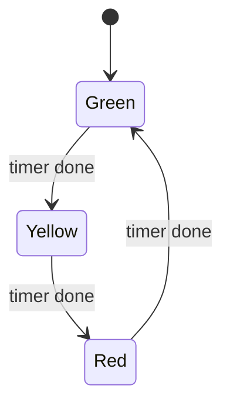

# Example - Traffic Light State Machine

> [!info] Source spine
- [[Presentations/02_PLC_lecture_2025_4pp-2.pdf|Lecture 02 - Counters and literals]]
- [[Presentations/03_PLC_lecture_2023.pdf|Lecture 03 - Structuring tasks and interrupts]]
- [[Presentations/04_PLC_lecture_2025.pdf|Lecture 04 - LD programming issues]]
- [[Presentations/05_PLC_lecture_2025_ST_6pp.pdf|Lecture 05 - Structured Text]]
- [[Presentations/07_PLC_lecture_2025_hardware_6pp.pdf|Lecture 07 - Hardware]]
- [[Presentations/08_PLC_lecture_2025_SFC_6pp.pdf|Lecture 08 - SFC]]
- [[Presentations/09_PLC_lecture_2025_discret_6pp.pdf|Lecture 09 - Discrete control]]
- [[Presentations/PLC_lecture_2025_communication_ASi_IOLink.pdf|Communication - S7-1200, AS-i, IO-Link]]

## Problem Statement
Cycle green, yellow, red lamps with fixed times.

## Solution
Use one state per lamp phase and a TON for phase duration.

## Explanation
- Reset the timer when changing phases.
- Never let conflicting lamps be assigned from unrelated logic.
- A fault phase can force red.

## Ladder Implementation
```text
StateGreen -> Green lamp and timer; timer done -> next state
```

## Structured Text Implementation
```iecst
PhaseTimer(IN := TRUE, PT := PhaseTime);
CASE Phase OF
0: Green := TRUE; IF PhaseTimer.Q THEN Phase := 1; END_IF;
1: Yellow := TRUE; IF PhaseTimer.Q THEN Phase := 2; END_IF;
2: Red := TRUE; IF PhaseTimer.Q THEN Phase := 0; END_IF;
END_CASE;
```

## Alternative Implementations
- Use vendor-provided function blocks where they reduce risk.
- Use SFC or an explicit state machine when the example grows into a sequence.

## Full Working Code

### Mermaid Diagram


### Assumptions And I/O
- Only one traffic phase is active at a time.
- Each phase uses its own preset time.
- The timer is reset on phase changes.

### Variable Declaration
```iecst
PROGRAM TrafficLightStateMachine
VAR_INPUT
    Enable : BOOL;
    Reset  : BOOL;
END_VAR
VAR_OUTPUT
    Green  : BOOL;
    Yellow : BOOL;
    Red    : BOOL;
END_VAR
VAR
    Phase      : INT := 0;
    PhaseTimer : TON;
    PhasePT    : TIME;
END_VAR
```

### Structured Text Program
```iecst
(* Input section *)
IF Reset OR (NOT Enable) THEN
    Phase := 0;
END_IF;

(* Work section *)
CASE Phase OF
0: PhasePT := T#10s;
1: PhasePT := T#2s;
2: PhasePT := T#10s;
END_CASE;

PhaseTimer(IN := Enable AND (NOT PhaseTimer.Q), PT := PhasePT);

IF Enable AND PhaseTimer.Q THEN
    Phase := Phase + 1;
    IF Phase > 2 THEN
        Phase := 0;
    END_IF;
END_IF;

(* Output section *)
Green := Enable AND (Phase = 0);
Yellow := Enable AND (Phase = 1);
Red := Enable AND (Phase = 2);
```

### Test Checklist
- Enable FALSE turns all lamps off and returns to Green phase.
- Only one lamp output is TRUE.
- The sequence cycles Green, Yellow, Red.

## Related Concepts
- [[Traffic Lights]]
- [[Sequential Programming]]
- [[TON]]
