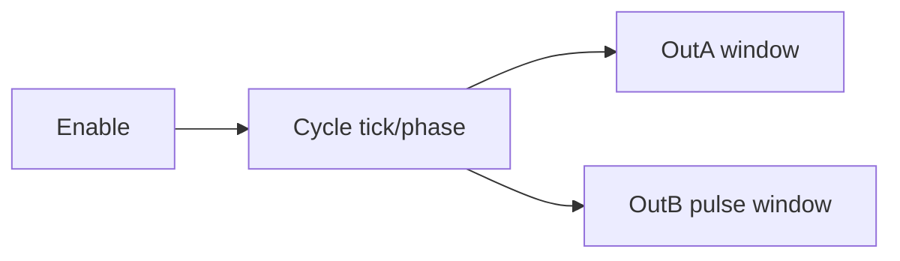

# Example - Two Output Timing Pattern

> [!info] Source spine
- [[Presentations/02_PLC_lecture_2025_4pp-2.pdf|Lecture 02 - Counters and literals]]
- [[Presentations/03_PLC_lecture_2023.pdf|Lecture 03 - Structuring tasks and interrupts]]
- [[Presentations/04_PLC_lecture_2025.pdf|Lecture 04 - LD programming issues]]
- [[Presentations/05_PLC_lecture_2025_ST_6pp.pdf|Lecture 05 - Structured Text]]
- [[Presentations/07_PLC_lecture_2025_hardware_6pp.pdf|Lecture 07 - Hardware]]
- [[Presentations/08_PLC_lecture_2025_SFC_6pp.pdf|Lecture 08 - SFC]]
- [[Presentations/09_PLC_lecture_2025_discret_6pp.pdf|Lecture 09 - Discrete control]]
- [[Presentations/PLC_lecture_2025_communication_ASi_IOLink.pdf|Communication - S7-1200, AS-i, IO-Link]]

## Problem Statement
Generate an OutA 10 s high/10 s low cycle and an OutB 2 s pulse in a 16 s window while enabled.

## Solution
Use an elapsed cycle timer or cyclic counter and compare elapsed time windows.

## Explanation
- The scan must maintain a cycle position.
- Use TP/TON chains for a pure timer solution, or a cyclic interrupt for precise windows.
- Reset outputs when Enable is FALSE.

## Ladder Implementation
```text
Enable -> timer/cycle counter -> comparisons -> OutA, OutB
```

## Structured Text Implementation
```iecst
(* called every scan with elapsed TIME CycleET *)
OutA := Enable AND (CycleSeconds < 10.0);
OutB := Enable AND (CycleSeconds >= 2.0) AND (CycleSeconds < 4.0);
IF CycleSeconds >= 16.0 THEN CycleSeconds := 0.0; END_IF;
```

## Alternative Implementations
- Use vendor-provided function blocks where they reduce risk.
- Use SFC or an explicit state machine when the example grows into a sequence.

## Full Working Code

### Mermaid Diagram


### Assumptions And I/O
- The program is called from a 100 ms cyclic interrupt for deterministic timing.
- One cycle lasts 16 s.
- OutA and OutB are derived from phase windows.

### Variable Declaration
```iecst
PROGRAM TwoOutputTimingPattern
VAR_INPUT
    Enable : BOOL;
END_VAR
VAR_OUTPUT
    OutA : BOOL;
    OutB : BOOL;
END_VAR
VAR
    Tick : INT;
END_VAR
```

### Structured Text Program
```iecst
(* Input section *)
(* Enable starts the periodic pattern. *)

(* Work section *)
IF Enable THEN
    Tick := Tick + 1;
    IF Tick >= 160 THEN
        Tick := 0;
    END_IF;
ELSE
    Tick := 0;
END_IF;

(* Output section *)
OutA := Enable AND (Tick < 100);                  (* 10 s high *)
OutB := Enable AND (Tick >= 20) AND (Tick < 40);  (* 2 s pulse *)
```

### Test Checklist
- Enable FALSE resets the cycle.
- OutA is TRUE for 10 s.
- OutB is TRUE between 2 s and 4 s of the cycle.

## Related Concepts
- [[Periodic Signal Generation]]
- [[Task 5 - Timed Output Pattern]]
- [[Task 6 - Cyclic Interrupt Timing]]
