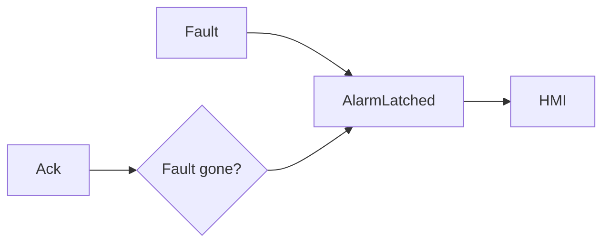

# Full Code - Alarm Latch With Acknowledge

## Full Working Code

### Mermaid Diagram


### Assumptions And I/O
- FaultCondition may be momentary.
- AlarmLatched stays TRUE until acknowledged after the fault clears.
- The HMI shows both active and latched states.

### Variable Declaration
```iecst
PROGRAM AlarmLatchWithAcknowledge
VAR_INPUT
    FaultCondition : BOOL;
    Ack            : BOOL;
END_VAR
VAR_OUTPUT
    AlarmActive  : BOOL;
    AlarmLatched : BOOL;
END_VAR
```

### Structured Text Program
```iecst
(* Input section *)
AlarmActive := FaultCondition;

(* Work section *)
IF FaultCondition THEN
    AlarmLatched := TRUE;
ELSIF Ack THEN
    AlarmLatched := FALSE;
END_IF;

(* Output section *)
(* AlarmActive shows current condition; AlarmLatched shows alarm memory. *)
```

### Test Checklist
- A short fault remains visible as AlarmLatched.
- Ack while fault is active does not clear the latch.
- Ack after fault clears resets AlarmLatched.
