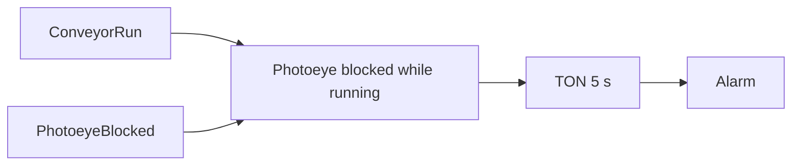

# Full Code - Conveyor Jam Detection

## Full Working Code

### Mermaid Diagram


### Assumptions And I/O
- PhotoeyeBlocked is TRUE when an item is sitting in front of the sensor.
- A jam is declared only if the conveyor is running.
- The alarm is latched until acknowledged after the condition clears.

### Variable Declaration
```iecst
PROGRAM ConveyorJamDetection
VAR_INPUT
    ConveyorRun     : BOOL;
    PhotoeyeBlocked : BOOL;
    Ack             : BOOL;
END_VAR
VAR_OUTPUT
    JamAlarm : BOOL;
END_VAR
VAR
    JamTimer : TON;
END_VAR
```

### Structured Text Program
```iecst
(* Input section *)
JamTimer(IN := ConveyorRun AND PhotoeyeBlocked, PT := T#5s);

(* Work section *)
IF JamTimer.Q THEN
    JamAlarm := TRUE;
ELSIF Ack AND (NOT PhotoeyeBlocked) THEN
    JamAlarm := FALSE;
END_IF;

(* Output section *)
(* JamAlarm goes to HMI/alarm list. *)
```

### Test Checklist
- Blocked for less than 5 s does not latch alarm.
- Blocked for 5 s while running latches alarm.
- Ack clears alarm only after the sensor clears.
