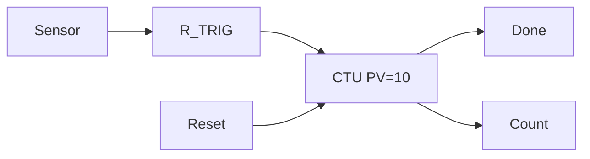

# Full Code - Counter With Reset And Done

## Full Working Code

### Mermaid Diagram


### Assumptions And I/O
- A part sensor may stay TRUE for many scans.
- Only one count should be added per detected item.
- Reset starts a new batch.

### Variable Declaration
```iecst
PROGRAM CounterWithResetAndDone
VAR_INPUT
    PartSensor : BOOL;
    Reset      : BOOL;
END_VAR
VAR_OUTPUT
    Count : INT;
    Done  : BOOL;
END_VAR
VAR
    PartEdge : R_TRIG;
    Batch    : CTU;
END_VAR
```

### Structured Text Program
```iecst
(* Input section *)
PartEdge(CLK := PartSensor);

(* Work section *)
Batch(CU := PartEdge.Q, R := Reset, PV := 10);

(* Output section *)
Count := Batch.CV;
Done := Batch.Q;
```

### Test Checklist
- Holding PartSensor TRUE adds only one count.
- After 10 parts, Done is TRUE.
- Reset clears Count to zero.
