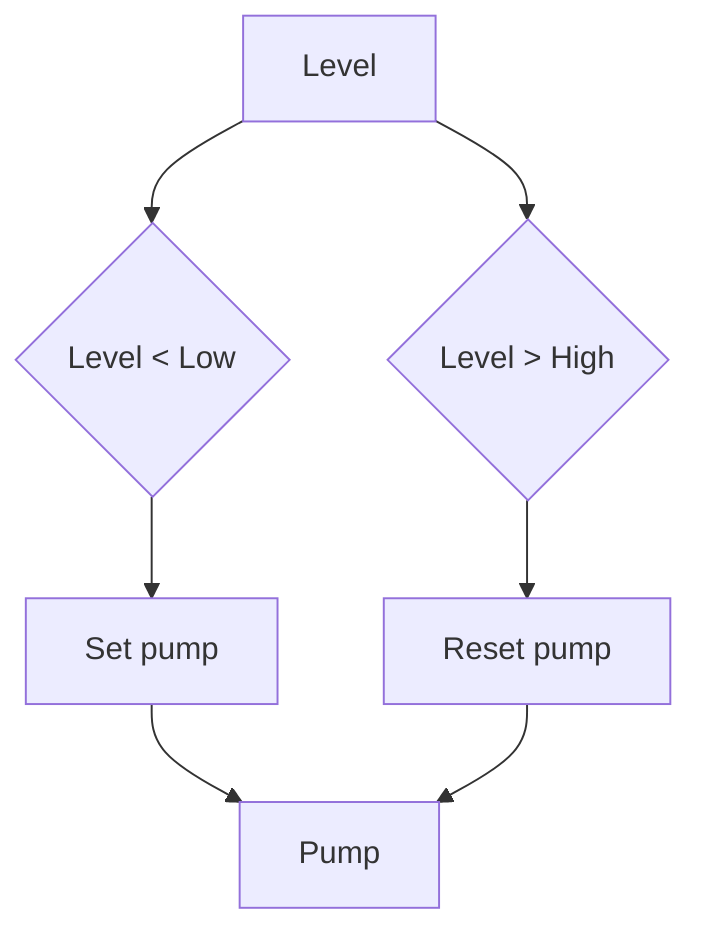

# Full Code - Pump With Low High Level Hysteresis

## Full Working Code

### Mermaid Diagram


### Assumptions And I/O
- Level is already scaled to percent.
- Pump starts below LowLevel and stops above HighLevel.
- FaultOK and AutoMode must be TRUE to run.

### Variable Declaration
```iecst
PROGRAM PumpHysteresis
VAR_INPUT
    LevelPercent : REAL;
    AutoMode     : BOOL;
    FaultOK      : BOOL;
END_VAR
VAR_OUTPUT
    PumpCmd : BOOL;
END_VAR
VAR
    LowLevel  : REAL := 30.0;
    HighLevel : REAL := 80.0;
    PumpLatch : BOOL;
END_VAR
```

### Structured Text Program
```iecst
(* Input section *)
(* LevelPercent is 0.0 to 100.0. *)

(* Work section *)
IF (NOT AutoMode) OR (NOT FaultOK) THEN
    PumpLatch := FALSE;
ELSIF LevelPercent < LowLevel THEN
    PumpLatch := TRUE;
ELSIF LevelPercent > HighLevel THEN
    PumpLatch := FALSE;
END_IF;

(* Output section *)
PumpCmd := PumpLatch AND AutoMode AND FaultOK;
```

### Test Checklist
- Level below 30 percent starts the pump.
- Level above 80 percent stops the pump.
- Between thresholds, the previous state is held.
