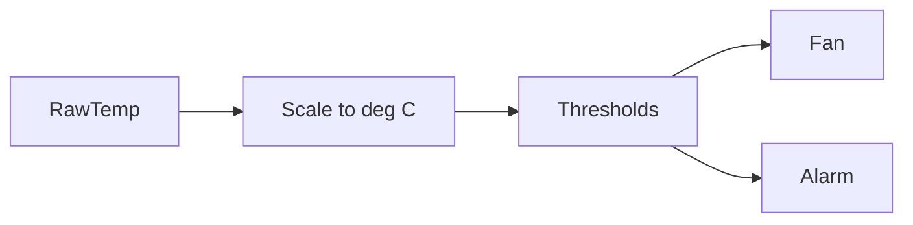

# Full Code - Temperature Alarm And Cooling Fan

## Full Working Code

### Mermaid Diagram


### Assumptions And I/O
- RawTemp is from a temperature analog channel.
- Temperature is scaled to 0..150 C.
- Fan uses hysteresis; alarm uses a higher fixed threshold.

### Variable Declaration
```iecst
PROGRAM TemperatureAlarmAndFan
VAR_INPUT
    RawTemp : INT;
END_VAR
VAR_OUTPUT
    TempC     : REAL;
    FanCmd    : BOOL;
    HighAlarm : BOOL;
END_VAR
VAR
    Norm : REAL;
END_VAR
```

### Structured Text Program
```iecst
(* Input section *)
Norm := NORM_X(MIN := 0, VALUE := RawTemp, MAX := 27648);
Norm := LIMIT(MN := 0.0, IN := Norm, MX := 1.0);
TempC := SCALE_X(MIN := 0.0, VALUE := Norm, MAX := 150.0);

(* Work section *)
IF TempC > 60.0 THEN
    FanCmd := TRUE;
ELSIF TempC < 50.0 THEN
    FanCmd := FALSE;
END_IF;

(* Output section *)
HighAlarm := TempC > 90.0;
```

### Test Checklist
- Fan starts above 60 C.
- Fan stops below 50 C.
- HighAlarm is TRUE above 90 C.
