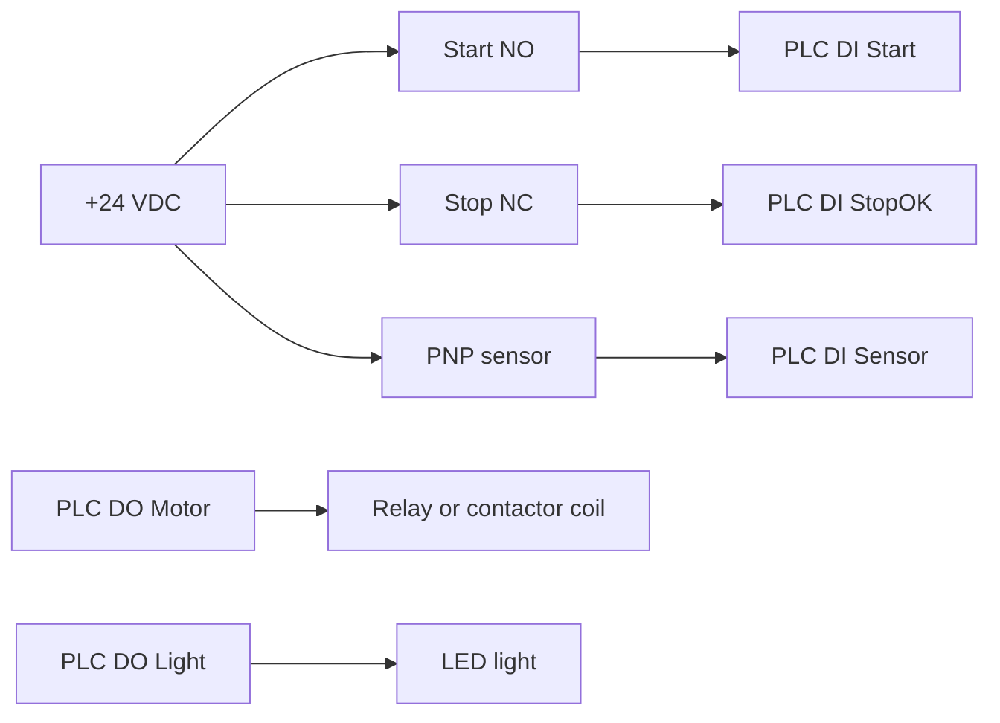

# Task 1 - PLC Wiring Diagram

> [!info] Source spine
- [[Presentations/02_PLC_lecture_2025_4pp-2.pdf|Lecture 02 - Counters and literals]]
- [[Presentations/03_PLC_lecture_2023.pdf|Lecture 03 - Structuring tasks and interrupts]]
- [[Presentations/04_PLC_lecture_2025.pdf|Lecture 04 - LD programming issues]]
- [[Presentations/05_PLC_lecture_2025_ST_6pp.pdf|Lecture 05 - Structured Text]]
- [[Presentations/07_PLC_lecture_2025_hardware_6pp.pdf|Lecture 07 - Hardware]]
- [[Presentations/08_PLC_lecture_2025_SFC_6pp.pdf|Lecture 08 - SFC]]
- [[Presentations/09_PLC_lecture_2025_discret_6pp.pdf|Lecture 09 - Discrete control]]
- [[Presentations/PLC_lecture_2025_communication_ASi_IOLink.pdf|Communication - S7-1200, AS-i, IO-Link]]

## Original Scan
![[Attachments/Task Scans/T_1-3.jpg]]

## Problem Statement
Inputs: monostable Start NO, Stop NC, and an industrial PNP inductive Sensor. Outputs: relay coil for a three-phase squirrel cage motor marked Motor and an LED indicator Light. Draw the electrical wiring diagram according to class rules.

## Analysis
- Identify input module common and sensor supply for PNP wiring.
- Start is a normally open field contact; Stop is normally closed for fail-safe behavior.
- Motor must be driven through relay/contactor coil, not directly by a PLC output.
- Light is a separate PLC output load.

## Solution
- Draw 24 VDC supply, input common, Start to DI, Stop NC to DI, PNP sensor output to DI.
- Draw output DO driving relay/contactor coil with proper supply/common and suppression.
- Draw separate DO for Light.
- Label all terminals and device names.

## Explanation
- This task belongs to the exam pattern practiced in the scanned task set.
- Prefer symbolic variables and clearly state assumptions such as input polarity, sample time, and analog range.

## Common Mistakes
- Ignoring stop/fault priority.
- Forgetting edge detection for per-press actions.
- Comparing unscaled analog raw values to engineering thresholds.
- Reusing one timer/counter/trigger instance for unrelated logic.

## Full Working Solution

### Mermaid Diagram


### Assumptions And I/O
- Names are symbolic and can be mapped to real PLC addresses in the tag table.
- The code is written in IEC 61131-3 Structured Text style; vendor syntax may need small adjustments.
- Safety functions shown in software are educational; real emergency-stop circuits require safety-rated hardware.

### Variable Declaration
```iecst
PROGRAM WiringTest
VAR_INPUT
    Start_DI  : BOOL;
    StopOK_DI : BOOL;
    Sensor_DI : BOOL;
END_VAR
VAR_OUTPUT
    Motor_DO : BOOL;
    Light_DO : BOOL;
END_VAR
VAR
    InputsHealthy : BOOL;
END_VAR
```

### Structured Text Program
```iecst
(* Input section *)
InputsHealthy := StopOK_DI;

(* Work section *)
Motor_DO := InputsHealthy AND Start_DI;
Light_DO := Sensor_DI;

(* Output section *)
(* Motor_DO energizes a relay/contactor coil. Light_DO energizes the LED. *)
```

### Test Checklist
- Pressing Start_DI with StopOK_DI TRUE energizes Motor_DO.
- Opening StopOK_DI de-energizes Motor_DO.
- Sensor_DI follows Light_DO in this simple wiring test.

## Related Theory
- [[PLC Wiring]]
- [[Digital Inputs and Outputs]]
- [[Emergency Stop]]

## Related PLC Instructions
- No single PLC instruction is central; this is mainly wiring/design.

## Related Applications
- [[Motor Start-Stop]]
- [[Emergency Stop]]
