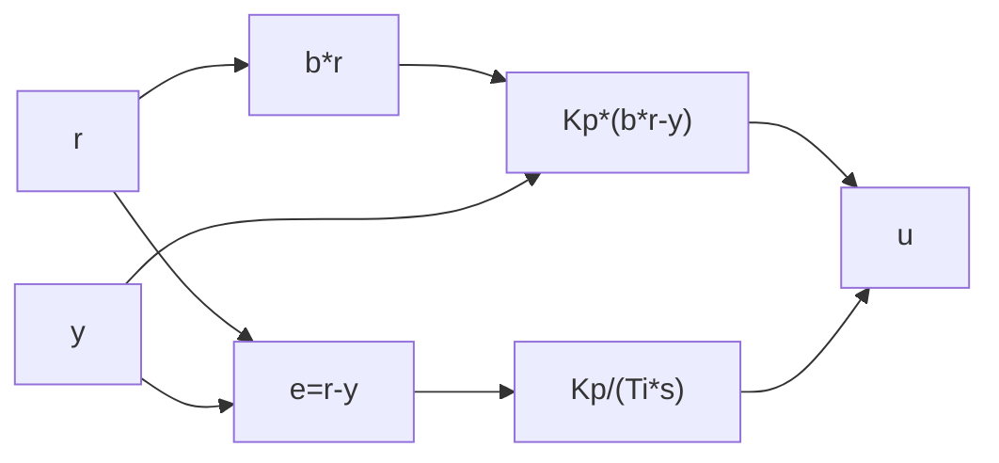

# Task 10 - PI Controller With Weighting

> [!info] Source spine
- [[Presentations/02_PLC_lecture_2025_4pp-2.pdf|Lecture 02 - Counters and literals]]
- [[Presentations/03_PLC_lecture_2023.pdf|Lecture 03 - Structuring tasks and interrupts]]
- [[Presentations/04_PLC_lecture_2025.pdf|Lecture 04 - LD programming issues]]
- [[Presentations/05_PLC_lecture_2025_ST_6pp.pdf|Lecture 05 - Structured Text]]
- [[Presentations/07_PLC_lecture_2025_hardware_6pp.pdf|Lecture 07 - Hardware]]
- [[Presentations/08_PLC_lecture_2025_SFC_6pp.pdf|Lecture 08 - SFC]]
- [[Presentations/09_PLC_lecture_2025_discret_6pp.pdf|Lecture 09 - Discrete control]]
- [[Presentations/PLC_lecture_2025_communication_ASi_IOLink.pdf|Communication - S7-1200, AS-i, IO-Link]]

## Original Scan
![[Attachments/Task Scans/T_9-10.jpg]]

## Problem Statement
Draw a block diagram and write the transfer function of the PI controller including the weighting factor b.

## Analysis
- Setpoint weighting usually changes the proportional path: u = Kp*(b*r - y) + integral of error.
- The integral term normally uses e = r - y to remove steady-state error.
- The answer should show both block structure and formula.

## Solution
- Block diagram: r splits to weighted proportional path b*r and error path r-y for integrator; y subtracts from both as applicable.
- Continuous form: u(s)=Kp*(b*r(s)-y(s)) + Kp/(Ti*s)*(r(s)-y(s)).
- Mention output limits and anti-windup for PLC implementation.

## Explanation
- This task belongs to the exam pattern practiced in the scanned task set.
- Prefer symbolic variables and clearly state assumptions such as input polarity, sample time, and analog range.

## Common Mistakes
- Ignoring stop/fault priority.
- Forgetting edge detection for per-press actions.
- Comparing unscaled analog raw values to engineering thresholds.
- Reusing one timer/counter/trigger instance for unrelated logic.

## Full Working Solution

### Mermaid Diagram


### Assumptions And I/O
- Names are symbolic and can be mapped to real PLC addresses in the tag table.
- The code is written in IEC 61131-3 Structured Text style; vendor syntax may need small adjustments.
- Safety functions shown in software are educational; real emergency-stop circuits require safety-rated hardware.

### Variable Declaration
```iecst
FUNCTION_BLOCK Task10_PIWeighting
VAR_INPUT
    R     : REAL;
    Y     : REAL;
    Kp    : REAL;
    Ti_s  : REAL;
    Ts_s  : REAL;
    B     : REAL;
    U_Min : REAL;
    U_Max : REAL;
    Reset : BOOL;
END_VAR
VAR_OUTPUT
    U : REAL;
END_VAR
VAR
    E  : REAL;
    P  : REAL;
    I  : REAL;
    U0 : REAL;
END_VAR
END_FUNCTION_BLOCK
```

### Structured Text Program
```iecst
(* Input section *)
E := R - Y;

(* Work section *)
IF Reset THEN
    I := 0.0;
END_IF;

P := Kp * (B * R - Y);
IF Ti_s > 0.0 THEN
    I := I + (Kp * Ts_s / Ti_s) * E;
END_IF;

U0 := P + I;

(* Output section *)
U := LIMIT(MN := U_Min, IN := U0, MX := U_Max);
```

### Test Checklist
- The transfer relationship is u = Kp*(b*r-y) + Kp/(Ti*s)*(r-y).
- B=1 gives normal proportional action on error.
- Use anti-windup for real actuator limits.

## Related Theory
- [[PID Control]]
- [[Discrete Approximation]]

## Related PLC Instructions
- [[PID_Compact]]
- [[LIMIT]]

## Related Applications
- [[PID Control in PLC]]
