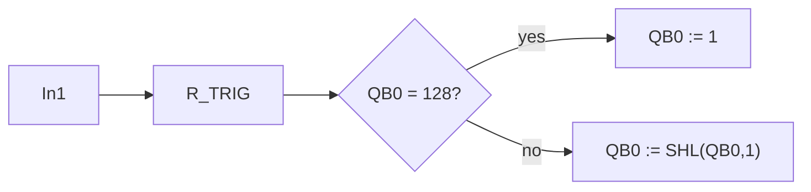

# Task 11 - One Bit Shift Register

> [!info] Source spine
- [[Presentations/02_PLC_lecture_2025_4pp-2.pdf|Lecture 02 - Counters and literals]]
- [[Presentations/03_PLC_lecture_2023.pdf|Lecture 03 - Structuring tasks and interrupts]]
- [[Presentations/04_PLC_lecture_2025.pdf|Lecture 04 - LD programming issues]]
- [[Presentations/05_PLC_lecture_2025_ST_6pp.pdf|Lecture 05 - Structured Text]]
- [[Presentations/07_PLC_lecture_2025_hardware_6pp.pdf|Lecture 07 - Hardware]]
- [[Presentations/08_PLC_lecture_2025_SFC_6pp.pdf|Lecture 08 - SFC]]
- [[Presentations/09_PLC_lecture_2025_discret_6pp.pdf|Lecture 09 - Discrete control]]
- [[Presentations/PLC_lecture_2025_communication_ASi_IOLink.pdf|Communication - S7-1200, AS-i, IO-Link]]

## Original Scan
![[Attachments/Task Scans/T_11-13.jpg]]

## Problem Statement
Turn on exactly one bit in output byte QB0. On each rising edge of In1, shift the turned-on bit left. When the extreme left position is reached, return to the extreme right position. Start with the far right bit in QB0 on.

## Analysis
- Use R_TRIG so one press causes one shift.
- Initialize QB0 to 2#00000001.
- Use SHL and wrap 2#10000000 back to 2#00000001.

## Solution
- If QB0=0 or Init then QB0 := 1.
- On Edge.Q: if QB0=128 then QB0:=1 else QB0:=SHL(QB0,1).
- Use BYTE constants for clarity.

## Explanation
- This task belongs to the exam pattern practiced in the scanned task set.
- Prefer symbolic variables and clearly state assumptions such as input polarity, sample time, and analog range.

## Common Mistakes
- Ignoring stop/fault priority.
- Forgetting edge detection for per-press actions.
- Comparing unscaled analog raw values to engineering thresholds.
- Reusing one timer/counter/trigger instance for unrelated logic.

## Full Working Solution

### Mermaid Diagram


### Assumptions And I/O
- Names are symbolic and can be mapped to real PLC addresses in the tag table.
- The code is written in IEC 61131-3 Structured Text style; vendor syntax may need small adjustments.
- Safety functions shown in software are educational; real emergency-stop circuits require safety-rated hardware.

### Variable Declaration
```iecst
PROGRAM Task11_OneBitShift
VAR_INPUT
    In1   : BOOL;
    Reset : BOOL;
END_VAR
VAR_OUTPUT
    QB0 : BYTE;
END_VAR
VAR
    Edge : R_TRIG;
END_VAR
```

### Structured Text Program
```iecst
(* Input section *)
Edge(CLK := In1);

(* Work section *)
IF Reset OR (QB0 = 0) THEN
    QB0 := 2#00000001;
ELSIF Edge.Q THEN
    IF QB0 = 2#10000000 THEN
        QB0 := 2#00000001;
    ELSE
        QB0 := SHL(IN := QB0, N := 1);
    END_IF;
END_IF;

(* Output section *)
(* QB0 is mapped to output byte QB0 in the PLC tag table. *)
```

### Test Checklist
- Only one bit is TRUE.
- One rising edge shifts one position.
- The leftmost bit wraps to the rightmost bit.

## Related Theory
- [[Edge Detection]]
- [[PLC Memory]]

## Related PLC Instructions
- [[R_TRIG]]
- [[SHL]]
- [[MOVE]]

## Related Applications
- [[One Bit Shift Register]]
