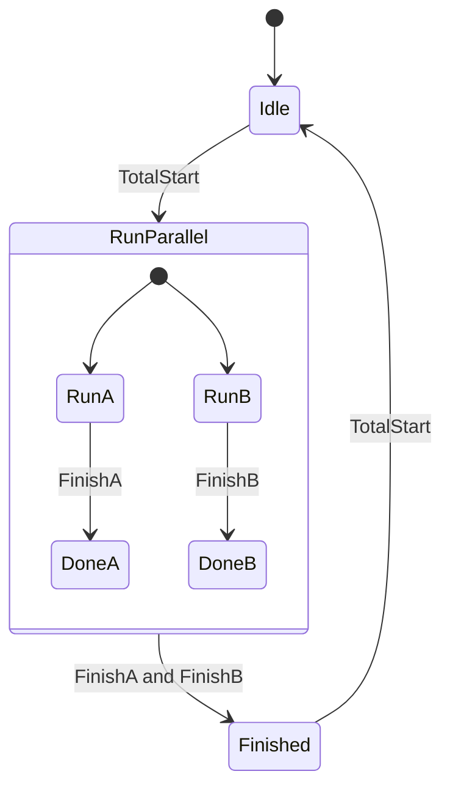

# Task 12 - Parallel SFC Processes

> [!info] Source spine
- [[Presentations/02_PLC_lecture_2025_4pp-2.pdf|Lecture 02 - Counters and literals]]
- [[Presentations/03_PLC_lecture_2023.pdf|Lecture 03 - Structuring tasks and interrupts]]
- [[Presentations/04_PLC_lecture_2025.pdf|Lecture 04 - LD programming issues]]
- [[Presentations/05_PLC_lecture_2025_ST_6pp.pdf|Lecture 05 - Structured Text]]
- [[Presentations/07_PLC_lecture_2025_hardware_6pp.pdf|Lecture 07 - Hardware]]
- [[Presentations/08_PLC_lecture_2025_SFC_6pp.pdf|Lecture 08 - SFC]]
- [[Presentations/09_PLC_lecture_2025_discret_6pp.pdf|Lecture 09 - Discrete control]]
- [[Presentations/PLC_lecture_2025_communication_ASi_IOLink.pdf|Communication - S7-1200, AS-i, IO-Link]]

## Original Scan
![[Attachments/Task Scans/T_11-13.jpg]]

## Problem Statement
Process A starts by StartA and sets FinishA when finished. Process B starts by StartB and sets FinishB when finished. Write SFC control for two concurrent processes so TotalFinish turns on when both finish, and both can be restarted simultaneously with TotalStart.

## Analysis
- This is a parallel SFC branch with synchronization join.
- TotalFinish must wait for FinishA AND FinishB.
- TotalStart restarts both branches together.

## Solution
- Initial step waits for TotalStart.
- Parallel branch A asserts StartA until FinishA; branch B asserts StartB until FinishB.
- Join transition is FinishA AND FinishB; action sets TotalFinish.
- Reset/restart returns to initial or branch-start steps.

## Explanation
- This task belongs to the exam pattern practiced in the scanned task set.
- Prefer symbolic variables and clearly state assumptions such as input polarity, sample time, and analog range.

## Common Mistakes
- Ignoring stop/fault priority.
- Forgetting edge detection for per-press actions.
- Comparing unscaled analog raw values to engineering thresholds.
- Reusing one timer/counter/trigger instance for unrelated logic.

## Full Working Solution

### Mermaid Diagram


### Assumptions And I/O
- Names are symbolic and can be mapped to real PLC addresses in the tag table.
- The code is written in IEC 61131-3 Structured Text style; vendor syntax may need small adjustments.
- Safety functions shown in software are educational; real emergency-stop circuits require safety-rated hardware.

### Variable Declaration
```iecst
PROGRAM Task12_ParallelProcesses
VAR_INPUT
    TotalStart : BOOL;
    FinishA    : BOOL;
    FinishB    : BOOL;
END_VAR
VAR_OUTPUT
    StartA      : BOOL;
    StartB      : BOOL;
    TotalFinish : BOOL;
END_VAR
VAR
    State : INT := 0;
END_VAR
```

### Structured Text Program
```iecst
(* Input section *)
(* TotalStart begins or restarts both processes. *)

(* Work section *)
CASE State OF
0: (* Idle *)
    TotalFinish := FALSE;
    IF TotalStart THEN
        State := 10;
    END_IF;

10: (* Run both processes *)
    IF FinishA AND FinishB THEN
        State := 20;
    END_IF;

20: (* Finished *)
    TotalFinish := TRUE;
    IF TotalStart THEN
        State := 10;
        TotalFinish := FALSE;
    END_IF;
END_CASE;

(* Output section *)
StartA := State = 10;
StartB := State = 10;
```

### Test Checklist
- TotalStart starts both A and B together.
- TotalFinish is TRUE only when FinishA and FinishB are TRUE.
- Both processes can be restarted from the finished state.

## Related Theory
- [[Sequential Programming]]
- [[Sequential Function Chart (SFC)]]

## Related PLC Instructions
- [[SET]]
- [[RESET]]

## Related Applications
- [[Sequential Machine]]
