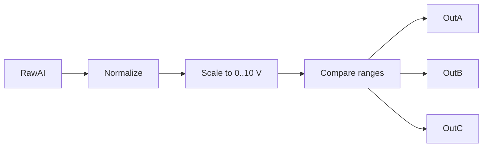

# Task 13 - Analog Threshold Outputs

> [!info] Source spine
- [[Presentations/02_PLC_lecture_2025_4pp-2.pdf|Lecture 02 - Counters and literals]]
- [[Presentations/03_PLC_lecture_2023.pdf|Lecture 03 - Structuring tasks and interrupts]]
- [[Presentations/04_PLC_lecture_2025.pdf|Lecture 04 - LD programming issues]]
- [[Presentations/05_PLC_lecture_2025_ST_6pp.pdf|Lecture 05 - Structured Text]]
- [[Presentations/07_PLC_lecture_2025_hardware_6pp.pdf|Lecture 07 - Hardware]]
- [[Presentations/08_PLC_lecture_2025_SFC_6pp.pdf|Lecture 08 - SFC]]
- [[Presentations/09_PLC_lecture_2025_discret_6pp.pdf|Lecture 09 - Discrete control]]
- [[Presentations/PLC_lecture_2025_communication_ASi_IOLink.pdf|Communication - S7-1200, AS-i, IO-Link]]

## Original Scan
![[Attachments/Task Scans/T_11-13.jpg]]

## Problem Statement
A unipolar signal source is connected to an analogue input with range +10 V. Turn on exactly one of three outputs: OutA if input is less than 2 V, OutB if signal is between 2 and 8 V, and OutC if signal exceeds 8 V. Choose an appropriate scaling method.

## Analysis
- Scale raw analog input to voltage before comparing.
- Use exclusive ranges with clear boundary decisions.
- Consider hysteresis for real noisy inputs.

## Solution
- Norm := NORM_X(raw range).
- Voltage := SCALE_X(0.0..10.0).
- OutA := Voltage < 2.0; OutB := Voltage >= 2.0 AND Voltage <= 8.0; OutC := Voltage > 8.0.

## Explanation
- This task belongs to the exam pattern practiced in the scanned task set.
- Prefer symbolic variables and clearly state assumptions such as input polarity, sample time, and analog range.

## Common Mistakes
- Ignoring stop/fault priority.
- Forgetting edge detection for per-press actions.
- Comparing unscaled analog raw values to engineering thresholds.
- Reusing one timer/counter/trigger instance for unrelated logic.

## Full Working Solution

### Mermaid Diagram


### Assumptions And I/O
- Names are symbolic and can be mapped to real PLC addresses in the tag table.
- The code is written in IEC 61131-3 Structured Text style; vendor syntax may need small adjustments.
- Safety functions shown in software are educational; real emergency-stop circuits require safety-rated hardware.

### Variable Declaration
```iecst
PROGRAM Task13_AnalogThresholds
VAR_INPUT
    RawAI : INT;
END_VAR
VAR_OUTPUT
    Voltage : REAL;
    OutA    : BOOL;
    OutB    : BOOL;
    OutC    : BOOL;
END_VAR
VAR
    Norm : REAL;
END_VAR
```

### Structured Text Program
```iecst
(* Input section *)
Norm := NORM_X(MIN := 0, VALUE := RawAI, MAX := 27648);
Norm := LIMIT(MN := 0.0, IN := Norm, MX := 1.0);
Voltage := SCALE_X(MIN := 0.0, VALUE := Norm, MAX := 10.0);

(* Work section *)
OutA := Voltage < 2.0;
OutB := (Voltage >= 2.0) AND (Voltage <= 8.0);
OutC := Voltage > 8.0;

(* Output section *)
(* OutA/OutB/OutC are the three mutually exclusive outputs. *)
```

### Test Checklist
- Below 2 V selects OutA.
- 2 V through 8 V selects OutB.
- Above 8 V selects OutC.

## Related Theory
- [[Analog Scaling]]

## Related PLC Instructions
- [[NORM_X]]
- [[SCALE_X]]
- [[COMPARE]]

## Related Applications
- [[Analog Threshold Classification]]
