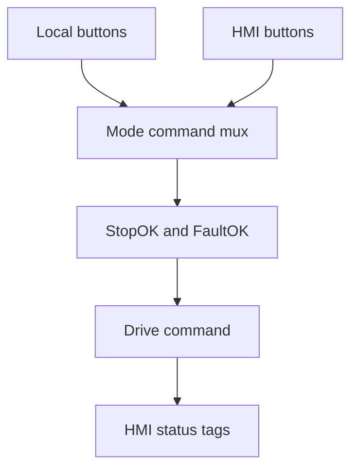

# Task 15 - HMI Drive Control

> [!info] Source spine
- [[Presentations/02_PLC_lecture_2025_4pp-2.pdf|Lecture 02 - Counters and literals]]
- [[Presentations/03_PLC_lecture_2023.pdf|Lecture 03 - Structuring tasks and interrupts]]
- [[Presentations/04_PLC_lecture_2025.pdf|Lecture 04 - LD programming issues]]
- [[Presentations/05_PLC_lecture_2025_ST_6pp.pdf|Lecture 05 - Structured Text]]
- [[Presentations/07_PLC_lecture_2025_hardware_6pp.pdf|Lecture 07 - Hardware]]
- [[Presentations/08_PLC_lecture_2025_SFC_6pp.pdf|Lecture 08 - SFC]]
- [[Presentations/09_PLC_lecture_2025_discret_6pp.pdf|Lecture 09 - Discrete control]]
- [[Presentations/PLC_lecture_2025_communication_ASi_IOLink.pdf|Communication - S7-1200, AS-i, IO-Link]]

## Original Scan
![[Attachments/Task Scans/T_14-15.jpg]]

## Problem Statement
Discuss how to modify the program from Task 3 so that the drive can additionally be controlled from the HMI and the drive status can be displayed on the HMI.

## Analysis
- Add HMI as another command source, not a bypass around stop/fault logic.
- Separate command, mode, feedback, and status.
- A safe stop and faults must dominate local and HMI start commands.

## Solution
- Add Auto/Manual or Local/HMI mode.
- Use command arbitration before common interlocks.
- Expose MotorCommand, MotorFeedback, Fault, InterlockOK, TimerRemaining, Mode, and Alarm bits to HMI.
- Require fresh start after stop/fault/mode change.

## Explanation
- This task belongs to the exam pattern practiced in the scanned task set.
- Prefer symbolic variables and clearly state assumptions such as input polarity, sample time, and analog range.

## Common Mistakes
- Ignoring stop/fault priority.
- Forgetting edge detection for per-press actions.
- Comparing unscaled analog raw values to engineering thresholds.
- Reusing one timer/counter/trigger instance for unrelated logic.

## Full Working Solution

### Mermaid Diagram


### Assumptions And I/O
- Names are symbolic and can be mapped to real PLC addresses in the tag table.
- The code is written in IEC 61131-3 Structured Text style; vendor syntax may need small adjustments.
- Safety functions shown in software are educational; real emergency-stop circuits require safety-rated hardware.

### Variable Declaration
```iecst
PROGRAM Task15_HMIDrive
VAR_INPUT
    LocalStart   : BOOL;
    LocalStop    : BOOL;
    HMI_Start    : BOOL;
    HMI_Stop     : BOOL;
    HMI_Mode     : BOOL; (* FALSE local, TRUE HMI *)
    StopOK       : BOOL;
    FaultOK      : BOOL;
    DriveFeedback : BOOL;
END_VAR
VAR_OUTPUT
    DriveCmd        : BOOL;
    HMI_RunCommand  : BOOL;
    HMI_RunFeedback : BOOL;
    HMI_Fault       : BOOL;
    HMI_ModeActive  : BOOL;
END_VAR
VAR
    RunRequest : BOOL;
    StartCmd   : BOOL;
    StopCmd    : BOOL;
END_VAR
```

### Structured Text Program
```iecst
(* Input section *)
IF HMI_Mode THEN
    StartCmd := HMI_Start;
    StopCmd := HMI_Stop;
ELSE
    StartCmd := LocalStart;
    StopCmd := LocalStop;
END_IF;

(* Work section *)
IF StopCmd OR (NOT StopOK) OR (NOT FaultOK) THEN
    RunRequest := FALSE;
ELSIF StartCmd THEN
    RunRequest := TRUE;
END_IF;

(* Output section *)
DriveCmd := RunRequest AND StopOK AND FaultOK;
HMI_RunCommand := DriveCmd;
HMI_RunFeedback := DriveFeedback;
HMI_Fault := NOT FaultOK;
HMI_ModeActive := HMI_Mode;
```

### Test Checklist
- Local mode uses local buttons.
- HMI mode uses HMI buttons.
- StopOK or FaultOK FALSE stops the drive in either mode.
- HMI displays command and feedback separately.

## Related Theory
- [[HMI and Manual Control]]
- [[PLC Memory]]
- [[Emergency Stop]]

## Related PLC Instructions
- [[SET]]
- [[RESET]]
- [[TON]]

## Related Applications
- [[HMI Manual Control]]
- [[Motor Run Time Limit]]
