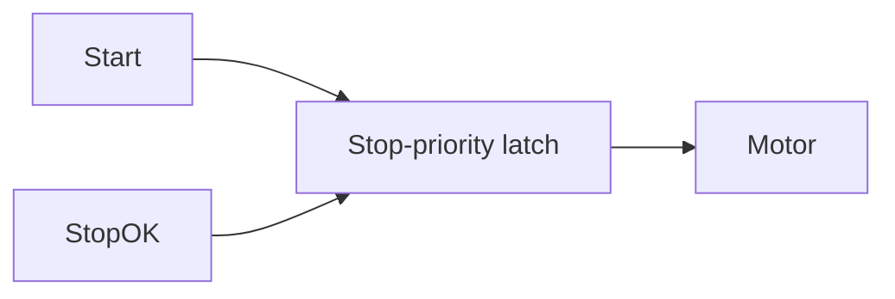

# Task 2 - Start Stop Motor

> [!info] Source spine
- [[Presentations/02_PLC_lecture_2025_4pp-2.pdf|Lecture 02 - Counters and literals]]
- [[Presentations/03_PLC_lecture_2023.pdf|Lecture 03 - Structuring tasks and interrupts]]
- [[Presentations/04_PLC_lecture_2025.pdf|Lecture 04 - LD programming issues]]
- [[Presentations/05_PLC_lecture_2025_ST_6pp.pdf|Lecture 05 - Structured Text]]
- [[Presentations/07_PLC_lecture_2025_hardware_6pp.pdf|Lecture 07 - Hardware]]
- [[Presentations/08_PLC_lecture_2025_SFC_6pp.pdf|Lecture 08 - SFC]]
- [[Presentations/09_PLC_lecture_2025_discret_6pp.pdf|Lecture 09 - Discrete control]]
- [[Presentations/PLC_lecture_2025_communication_ASi_IOLink.pdf|Communication - S7-1200, AS-i, IO-Link]]

## Original Scan
![[Attachments/Task Scans/T_1-3.jpg]]

## Problem Statement
Write a program in any PLC language to switch on the motor when Start is pressed and switch it off when Stop is pressed. Pressing both pushbuttons at the same time must definitely not switch on the motor.

## Analysis
- This is a stop-priority latch.
- The simultaneous Start+Stop case is solved by putting StopOK in series with the latch expression.
- Use symbolic variables so NC wiring does not confuse the program.

## Solution
- Motor := StopOK AND (Start OR Motor).
- If using SET/RESET coils, make reset dominate and document execution order.
- Add overload/fault contacts in series in real systems.

## Explanation
- This task belongs to the exam pattern practiced in the scanned task set.
- Prefer symbolic variables and clearly state assumptions such as input polarity, sample time, and analog range.

## Common Mistakes
- Ignoring stop/fault priority.
- Forgetting edge detection for per-press actions.
- Comparing unscaled analog raw values to engineering thresholds.
- Reusing one timer/counter/trigger instance for unrelated logic.

## Full Working Solution

### Mermaid Diagram


### Assumptions And I/O
- Names are symbolic and can be mapped to real PLC addresses in the tag table.
- The code is written in IEC 61131-3 Structured Text style; vendor syntax may need small adjustments.
- Safety functions shown in software are educational; real emergency-stop circuits require safety-rated hardware.

### Variable Declaration
```iecst
PROGRAM Task2_StartStopMotor
VAR_INPUT
    Start  : BOOL;
    StopOK : BOOL;
END_VAR
VAR_OUTPUT
    Motor : BOOL;
END_VAR
VAR
    RunLatch : BOOL;
END_VAR
```

### Structured Text Program
```iecst
(* Input section *)
(* StopOK is TRUE when the NC stop button is not pressed. *)

(* Work section *)
RunLatch := StopOK AND (Start OR RunLatch);

(* Output section *)
Motor := RunLatch;
```

### Ladder Version
```text
| StopOK |----+----| Start |----( Motor )
              |
              +----| Motor |
```

### Test Checklist
- Start TRUE and StopOK TRUE turns Motor on.
- StopOK FALSE turns Motor off.
- Start TRUE and StopOK FALSE leaves Motor off.

## Related Theory
- [[Start-Stop Latch]]
- [[PLC Scan Cycle]]
- [[Digital Inputs and Outputs]]

## Related PLC Instructions
- [[SET]]
- [[RESET]]

## Related Applications
- [[Motor Start-Stop]]
- [[Emergency Stop]]
