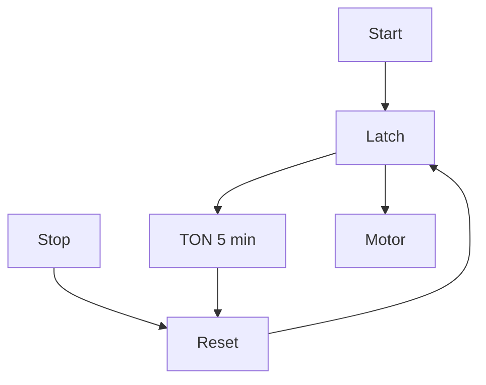

# Task 3 - Motor Run Time Limit

> [!info] Source spine
- [[Presentations/02_PLC_lecture_2025_4pp-2.pdf|Lecture 02 - Counters and literals]]
- [[Presentations/03_PLC_lecture_2023.pdf|Lecture 03 - Structuring tasks and interrupts]]
- [[Presentations/04_PLC_lecture_2025.pdf|Lecture 04 - LD programming issues]]
- [[Presentations/05_PLC_lecture_2025_ST_6pp.pdf|Lecture 05 - Structured Text]]
- [[Presentations/07_PLC_lecture_2025_hardware_6pp.pdf|Lecture 07 - Hardware]]
- [[Presentations/08_PLC_lecture_2025_SFC_6pp.pdf|Lecture 08 - SFC]]
- [[Presentations/09_PLC_lecture_2025_discret_6pp.pdf|Lecture 09 - Discrete control]]
- [[Presentations/PLC_lecture_2025_communication_ASi_IOLink.pdf|Communication - S7-1200, AS-i, IO-Link]]

## Original Scan
![[Attachments/Task Scans/T_1-3.jpg]]

## Problem Statement
Modify Task 2 to limit motor running time to a maximum of 5 minutes. Start turns the motor on; after 5 minutes the motor switches off automatically. The user can switch it off earlier using Stop.

## Analysis
- The run latch must reset on Stop or timer done.
- TON is appropriate because the timeout should occur after continuous running.
- Timer input should be Motor or MotorLatch.

## Solution
- RunLimit(IN := Motor, PT := T#5m).
- Reset MotorLatch when StopPressed OR RunLimit.Q.
- Start can set the latch only when stop/fault conditions permit.

## Explanation
- This task belongs to the exam pattern practiced in the scanned task set.
- Prefer symbolic variables and clearly state assumptions such as input polarity, sample time, and analog range.

## Common Mistakes
- Ignoring stop/fault priority.
- Forgetting edge detection for per-press actions.
- Comparing unscaled analog raw values to engineering thresholds.
- Reusing one timer/counter/trigger instance for unrelated logic.

## Full Working Solution

### Mermaid Diagram


### Assumptions And I/O
- Names are symbolic and can be mapped to real PLC addresses in the tag table.
- The code is written in IEC 61131-3 Structured Text style; vendor syntax may need small adjustments.
- Safety functions shown in software are educational; real emergency-stop circuits require safety-rated hardware.

### Variable Declaration
```iecst
PROGRAM Task3_MotorRunTimeLimit
VAR_INPUT
    Start  : BOOL;
    StopOK : BOOL;
END_VAR
VAR_OUTPUT
    Motor    : BOOL;
    TimeDone : BOOL;
END_VAR
VAR
    RunLatch : BOOL;
    T_Run    : TON;
END_VAR
```

### Structured Text Program
```iecst
(* Input section *)
(* StopOK is TRUE when stopping is not requested. *)

(* Work section *)
T_Run(IN := RunLatch, PT := T#5m);
TimeDone := T_Run.Q;

IF (NOT StopOK) OR TimeDone THEN
    RunLatch := FALSE;
ELSIF Start AND StopOK THEN
    RunLatch := TRUE;
END_IF;

(* Output section *)
Motor := RunLatch AND StopOK;
```

### Test Checklist
- Motor turns on after Start if StopOK is TRUE.
- Motor turns off after 5 minutes.
- StopOK FALSE turns Motor off before timeout.

## Related Theory
- [[Timers]]
- [[Start-Stop Latch]]

## Related PLC Instructions
- [[TON]]
- [[RESET]]

## Related Applications
- [[Motor Run Time Limit]]
