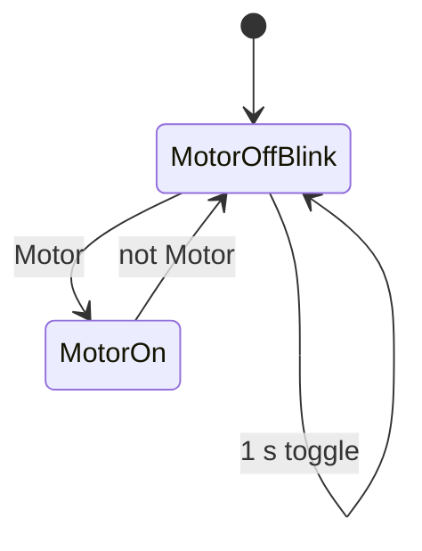

# Task 4 - Motor Light Flashing

> [!info] Source spine
- [[Presentations/02_PLC_lecture_2025_4pp-2.pdf|Lecture 02 - Counters and literals]]
- [[Presentations/03_PLC_lecture_2023.pdf|Lecture 03 - Structuring tasks and interrupts]]
- [[Presentations/04_PLC_lecture_2025.pdf|Lecture 04 - LD programming issues]]
- [[Presentations/05_PLC_lecture_2025_ST_6pp.pdf|Lecture 05 - Structured Text]]
- [[Presentations/07_PLC_lecture_2025_hardware_6pp.pdf|Lecture 07 - Hardware]]
- [[Presentations/08_PLC_lecture_2025_SFC_6pp.pdf|Lecture 08 - SFC]]
- [[Presentations/09_PLC_lecture_2025_discret_6pp.pdf|Lecture 09 - Discrete control]]
- [[Presentations/PLC_lecture_2025_communication_ASi_IOLink.pdf|Communication - S7-1200, AS-i, IO-Link]]

## Original Scan
![[Attachments/Task Scans/T_4.jpg]]

## Problem Statement
Add logic for Light. When the motor is off, Light flashes with a 2 s period and 50 percent fill. When the motor is on, Light is continuously on.

## Analysis
- A 2 s period with 50 percent duty means 1 s on and 1 s off.
- Motor ON overrides flashing.
- Timer/state implementation is simpler than trying to use one output coil in many rungs.

## Solution
- Use a 1 s TON to toggle BlinkState while Motor is FALSE.
- Light := Motor OR ((NOT Motor) AND BlinkState).
- Reset or initialize BlinkState if a fixed phase is required.

## Explanation
- This task belongs to the exam pattern practiced in the scanned task set.
- Prefer symbolic variables and clearly state assumptions such as input polarity, sample time, and analog range.

## Common Mistakes
- Ignoring stop/fault priority.
- Forgetting edge detection for per-press actions.
- Comparing unscaled analog raw values to engineering thresholds.
- Reusing one timer/counter/trigger instance for unrelated logic.

## Full Working Solution

### Mermaid Diagram


### Assumptions And I/O
- Names are symbolic and can be mapped to real PLC addresses in the tag table.
- The code is written in IEC 61131-3 Structured Text style; vendor syntax may need small adjustments.
- Safety functions shown in software are educational; real emergency-stop circuits require safety-rated hardware.

### Variable Declaration
```iecst
PROGRAM Task4_MotorLight
VAR_INPUT
    Motor : BOOL;
END_VAR
VAR_OUTPUT
    Light : BOOL;
END_VAR
VAR
    BlinkState : BOOL;
    T_Half     : TON;
END_VAR
```

### Structured Text Program
```iecst
(* Input section *)
(* Motor is TRUE when motor command is active. *)

(* Work section *)
T_Half(IN := (NOT Motor) AND (NOT T_Half.Q), PT := T#1s);

IF Motor THEN
    BlinkState := FALSE;
ELSIF T_Half.Q THEN
    BlinkState := NOT BlinkState;
END_IF;

(* Output section *)
Light := Motor OR ((NOT Motor) AND BlinkState);
```

### Test Checklist
- Motor TRUE makes Light TRUE continuously.
- Motor FALSE makes Light blink at 2 s period.
- Blink duty is approximately 50 percent.

## Related Theory
- [[Timers]]
- [[PLC Scan Cycle]]

## Related PLC Instructions
- [[TON]]

## Related Applications
- [[Periodic Signal Generation]]
