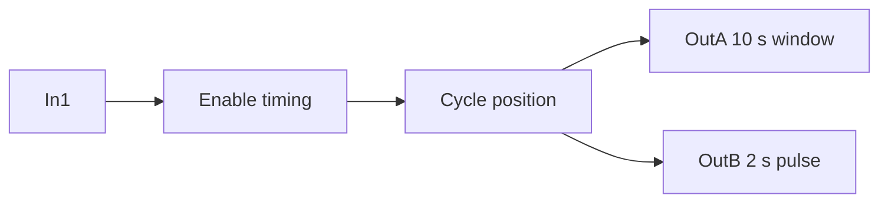

# Task 5 - Timed Output Pattern

> [!info] Source spine
- [[Presentations/02_PLC_lecture_2025_4pp-2.pdf|Lecture 02 - Counters and literals]]
- [[Presentations/03_PLC_lecture_2023.pdf|Lecture 03 - Structuring tasks and interrupts]]
- [[Presentations/04_PLC_lecture_2025.pdf|Lecture 04 - LD programming issues]]
- [[Presentations/05_PLC_lecture_2025_ST_6pp.pdf|Lecture 05 - Structured Text]]
- [[Presentations/07_PLC_lecture_2025_hardware_6pp.pdf|Lecture 07 - Hardware]]
- [[Presentations/08_PLC_lecture_2025_SFC_6pp.pdf|Lecture 08 - SFC]]
- [[Presentations/09_PLC_lecture_2025_discret_6pp.pdf|Lecture 09 - Discrete control]]
- [[Presentations/PLC_lecture_2025_communication_ASi_IOLink.pdf|Communication - S7-1200, AS-i, IO-Link]]

## Original Scan
![[Attachments/Task Scans/T_5-6.jpg]]

## Problem Statement
A bistable NO switch In1 enables a program that generates periodic continuous signals on OutA and OutB according to the shown timing diagram. Use appropriate timers.

## Analysis
- OutA has 10 s on/off style intervals in the scan.
- OutB is a shorter 2 s pulse inside a longer 16 s cycle.
- The exact waveform is best represented as elapsed-time windows.

## Solution
- Create an enabled cycle timer/counter.
- OutA TRUE during the 10 s on-window.
- OutB TRUE during the 2 s pulse window.
- Reset cycle state when In1 is off.

## Explanation
- This task belongs to the exam pattern practiced in the scanned task set.
- Prefer symbolic variables and clearly state assumptions such as input polarity, sample time, and analog range.

## Common Mistakes
- Ignoring stop/fault priority.
- Forgetting edge detection for per-press actions.
- Comparing unscaled analog raw values to engineering thresholds.
- Reusing one timer/counter/trigger instance for unrelated logic.

## Full Working Solution

### Mermaid Diagram


### Assumptions And I/O
- Names are symbolic and can be mapped to real PLC addresses in the tag table.
- The code is written in IEC 61131-3 Structured Text style; vendor syntax may need small adjustments.
- Safety functions shown in software are educational; real emergency-stop circuits require safety-rated hardware.

### Variable Declaration
```iecst
PROGRAM Task5_TimerPattern
VAR_INPUT
    In1 : BOOL;
END_VAR
VAR_OUTPUT
    OutA : BOOL;
    OutB : BOOL;
END_VAR
VAR
    Phase      : INT;
    StepTimer  : TON;
END_VAR
```

### Structured Text Program
```iecst
(* Input section *)
(* In1 enables the repeated pattern. *)

(* Work section *)
IF NOT In1 THEN
    Phase := 0;
END_IF;

StepTimer(IN := In1 AND (NOT StepTimer.Q), PT := T#2s);

IF In1 AND StepTimer.Q THEN
    Phase := Phase + 1;
    IF Phase >= 8 THEN
        Phase := 0;
    END_IF;
END_IF;

(* Output section *)
(* 8 phases * 2 s = 16 s cycle. Adjust phase windows to the task diagram. *)
OutA := In1 AND (Phase < 5);              (* first 10 s *)
OutB := In1 AND (Phase = 1);              (* 2 s pulse from 2 s to 4 s *)
```

### Test Checklist
- In1 FALSE resets the pattern.
- OutA is TRUE for the first five 2 s phases.
- OutB is TRUE for one 2 s phase.
- For exact exam timing, align Phase windows to the provided diagram.

## Related Theory
- [[Timers]]
- [[PLC Scan Cycle]]

## Related PLC Instructions
- [[TON]]
- [[TP]]
- [[COMPARE]]

## Related Applications
- [[Periodic Signal Generation]]
