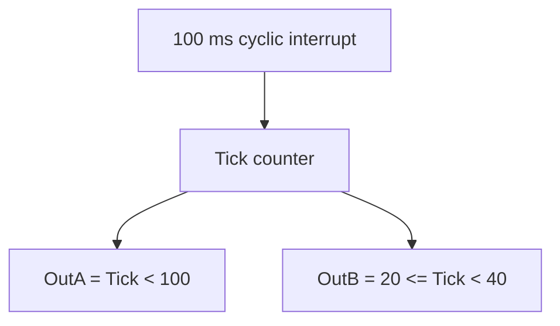

# Task 6 - Cyclic Interrupt Timing

> [!info] Source spine
- [[Presentations/02_PLC_lecture_2025_4pp-2.pdf|Lecture 02 - Counters and literals]]
- [[Presentations/03_PLC_lecture_2023.pdf|Lecture 03 - Structuring tasks and interrupts]]
- [[Presentations/04_PLC_lecture_2025.pdf|Lecture 04 - LD programming issues]]
- [[Presentations/05_PLC_lecture_2025_ST_6pp.pdf|Lecture 05 - Structured Text]]
- [[Presentations/07_PLC_lecture_2025_hardware_6pp.pdf|Lecture 07 - Hardware]]
- [[Presentations/08_PLC_lecture_2025_SFC_6pp.pdf|Lecture 08 - SFC]]
- [[Presentations/09_PLC_lecture_2025_discret_6pp.pdf|Lecture 09 - Discrete control]]
- [[Presentations/PLC_lecture_2025_communication_ASi_IOLink.pdf|Communication - S7-1200, AS-i, IO-Link]]

## Original Scan
![[Attachments/Task Scans/T_5-6.jpg]]

## Problem Statement
Write a program that implements the function from Task 5, but uses a cyclic interrupt instead of timers.

## Analysis
- The cyclic interrupt period becomes the time base.
- A tick counter replaces timer ET values.
- Outputs are comparisons against tick windows.

## Solution
- Configure a known cyclic period such as 100 ms.
- Increment Tick while In1 is TRUE.
- Use modulo/wrap at the cycle length.
- Map tick ranges to OutA and OutB.

## Explanation
- This task belongs to the exam pattern practiced in the scanned task set.
- Prefer symbolic variables and clearly state assumptions such as input polarity, sample time, and analog range.

## Common Mistakes
- Ignoring stop/fault priority.
- Forgetting edge detection for per-press actions.
- Comparing unscaled analog raw values to engineering thresholds.
- Reusing one timer/counter/trigger instance for unrelated logic.

## Full Working Solution

### Mermaid Diagram


### Assumptions And I/O
- Names are symbolic and can be mapped to real PLC addresses in the tag table.
- The code is written in IEC 61131-3 Structured Text style; vendor syntax may need small adjustments.
- Safety functions shown in software are educational; real emergency-stop circuits require safety-rated hardware.

### Variable Declaration
```iecst
PROGRAM Task6_CyclicPattern
VAR_INPUT
    In1 : BOOL;
END_VAR
VAR_OUTPUT
    OutA : BOOL;
    OutB : BOOL;
END_VAR
VAR
    Tick : INT;
END_VAR
```

### Structured Text Program
```iecst
(* Input section *)
(* Called every 100 ms from a cyclic interrupt OB. *)

(* Work section *)
IF In1 THEN
    Tick := Tick + 1;
    IF Tick >= 160 THEN
        Tick := 0;
    END_IF;
ELSE
    Tick := 0;
END_IF;

(* Output section *)
OutA := In1 AND (Tick < 100);
OutB := In1 AND (Tick >= 20) AND (Tick < 40);
```

### Test Checklist
- Tick 0..159 represents 0..15.9 s.
- OutA is TRUE for 10 s.
- OutB is TRUE for 2 s.

## Related Theory
- [[Cyclic Interrupt]]
- [[Discrete Approximation]]

## Related PLC Instructions
- [[COMPARE]]
- [[MOVE]]

## Related Applications
- [[Cyclic Interrupt Pulse Generator]]
- [[Periodic Signal Generation]]
