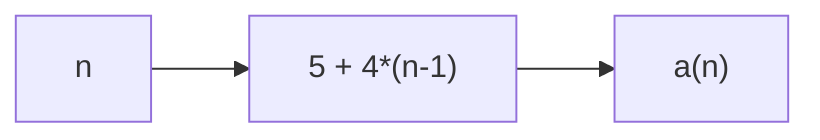

# Task 8 - Arithmetic Sequence Block

> [!info] Source spine
- [[Presentations/02_PLC_lecture_2025_4pp-2.pdf|Lecture 02 - Counters and literals]]
- [[Presentations/03_PLC_lecture_2023.pdf|Lecture 03 - Structuring tasks and interrupts]]
- [[Presentations/04_PLC_lecture_2025.pdf|Lecture 04 - LD programming issues]]
- [[Presentations/05_PLC_lecture_2025_ST_6pp.pdf|Lecture 05 - Structured Text]]
- [[Presentations/07_PLC_lecture_2025_hardware_6pp.pdf|Lecture 07 - Hardware]]
- [[Presentations/08_PLC_lecture_2025_SFC_6pp.pdf|Lecture 08 - SFC]]
- [[Presentations/09_PLC_lecture_2025_discret_6pp.pdf|Lecture 09 - Discrete control]]
- [[Presentations/PLC_lecture_2025_communication_ASi_IOLink.pdf|Communication - S7-1200, AS-i, IO-Link]]

## Original Scan
![[Attachments/Task Scans/T_8.jpg]]

## Problem Statement
Write a function or function block to determine a sequence: a(1)=5.0, a(n)=a(n-1)+4.0 for n>1. Input n is a natural number greater than 0; output is REAL.

## Analysis
- Because there is no required memory, a FUNCTION is enough.
- The closed form is a(n)=5.0+4.0*(n-1).
- Avoid recursion or loops unless requested.

## Solution
- FUNCTION SeqValue : REAL.
- SeqValue := 5.0 + 4.0 * UINT_TO_REAL(n - 1).
- Optionally guard n=0 defensively.

## Explanation
- This task belongs to the exam pattern practiced in the scanned task set.
- Prefer symbolic variables and clearly state assumptions such as input polarity, sample time, and analog range.

## Common Mistakes
- Ignoring stop/fault priority.
- Forgetting edge detection for per-press actions.
- Comparing unscaled analog raw values to engineering thresholds.
- Reusing one timer/counter/trigger instance for unrelated logic.

## Full Working Solution

### Mermaid Diagram


### Assumptions And I/O
- Names are symbolic and can be mapped to real PLC addresses in the tag table.
- The code is written in IEC 61131-3 Structured Text style; vendor syntax may need small adjustments.
- Safety functions shown in software are educational; real emergency-stop circuits require safety-rated hardware.

### Variable Declaration
```iecst
FUNCTION Task8_SeqValue : REAL
VAR_INPUT
    n : UINT;
END_VAR
END_FUNCTION
```

### Structured Text Program
```iecst
(* Input section *)
(* n should be greater than zero according to the task. *)

(* Work and output section *)
IF n = 0 THEN
    Task8_SeqValue := 0.0;
ELSE
    Task8_SeqValue := 5.0 + 4.0 * UINT_TO_REAL(n - 1);
END_IF;
```

### Test Checklist
- n=1 returns 5.0.
- n=2 returns 9.0.
- A function is enough because no memory is needed.

## Related Theory
- [[Function Blocks]]
- [[Structured Text (ST)]]
- [[IEC 61131-3]]

## Related PLC Instructions
- [[MOVE]]

## Related Applications
- [[Reusable Function Block]]
