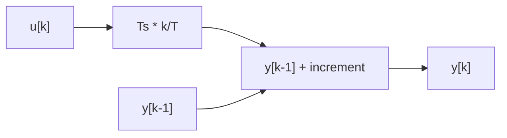

# Task 9 - Digital Approximation

> [!info] Source spine
- [[Presentations/02_PLC_lecture_2025_4pp-2.pdf|Lecture 02 - Counters and literals]]
- [[Presentations/03_PLC_lecture_2023.pdf|Lecture 03 - Structuring tasks and interrupts]]
- [[Presentations/04_PLC_lecture_2025.pdf|Lecture 04 - LD programming issues]]
- [[Presentations/05_PLC_lecture_2025_ST_6pp.pdf|Lecture 05 - Structured Text]]
- [[Presentations/07_PLC_lecture_2025_hardware_6pp.pdf|Lecture 07 - Hardware]]
- [[Presentations/08_PLC_lecture_2025_SFC_6pp.pdf|Lecture 08 - SFC]]
- [[Presentations/09_PLC_lecture_2025_discret_6pp.pdf|Lecture 09 - Discrete control]]
- [[Presentations/PLC_lecture_2025_communication_ASi_IOLink.pdf|Communication - S7-1200, AS-i, IO-Link]]

## Original Scan
![[Attachments/Task Scans/T_9-10.jpg]]

## Problem Statement
A dynamic block with transmittance G1(s)=k/(T*s) is given. Propose a digital approximation realized in a PLC for k=2.5 and T=3 s.

## Analysis
- G(s)=k/(T*s) is an integrator with gain k/T.
- Digital implementation needs sample time Ts.
- A simple forward Euler form is acceptable for an exam solution if assumptions are stated.

## Solution
- Use y[k] = y[k-1] + Ts*(2.5/3.0)*u[k].
- Run this in a cyclic interrupt with Ts in seconds.
- Store y between calls and add output limits if the process requires them.

## Explanation
- This task belongs to the exam pattern practiced in the scanned task set.
- Prefer symbolic variables and clearly state assumptions such as input polarity, sample time, and analog range.

## Common Mistakes
- Ignoring stop/fault priority.
- Forgetting edge detection for per-press actions.
- Comparing unscaled analog raw values to engineering thresholds.
- Reusing one timer/counter/trigger instance for unrelated logic.

## Full Working Solution

### Mermaid Diagram


### Assumptions And I/O
- Names are symbolic and can be mapped to real PLC addresses in the tag table.
- The code is written in IEC 61131-3 Structured Text style; vendor syntax may need small adjustments.
- Safety functions shown in software are educational; real emergency-stop circuits require safety-rated hardware.

### Variable Declaration
```iecst
FUNCTION_BLOCK Task9_DiscreteIntegrator
VAR_INPUT
    U     : REAL;
    Ts_s  : REAL := 0.1;
    Reset : BOOL;
END_VAR
VAR_OUTPUT
    Y : REAL;
END_VAR
VAR
    K : REAL := 2.5;
    T : REAL := 3.0;
END_VAR
END_FUNCTION_BLOCK
```

### Structured Text Program
```iecst
(* Input section *)
(* U is the current input sample. Ts_s is the cyclic call period in seconds. *)

(* Work section *)
IF Reset THEN
    Y := 0.0;
ELSE
    Y := Y + Ts_s * (K / T) * U;
END_IF;

(* Output section *)
(* Y is the discrete approximation of k/(T*s). *)
```

### Test Checklist
- Call the block at a fixed Ts_s.
- Reset initializes the integrator.
- For k=2.5 and T=3, the gain is 0.8333 per second.

## Related Theory
- [[Discrete Approximation]]
- [[Cyclic Interrupt]]
- [[PID Control]]

## Related PLC Instructions
- [[MOVE]]
- [[LIMIT]]

## Related Applications
- [[Digital Approximation in PLC]]
